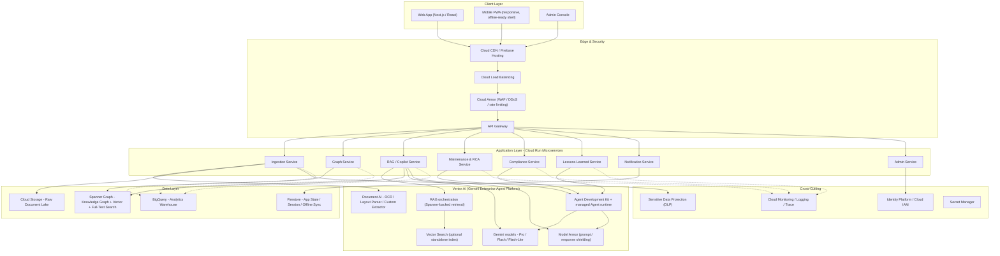
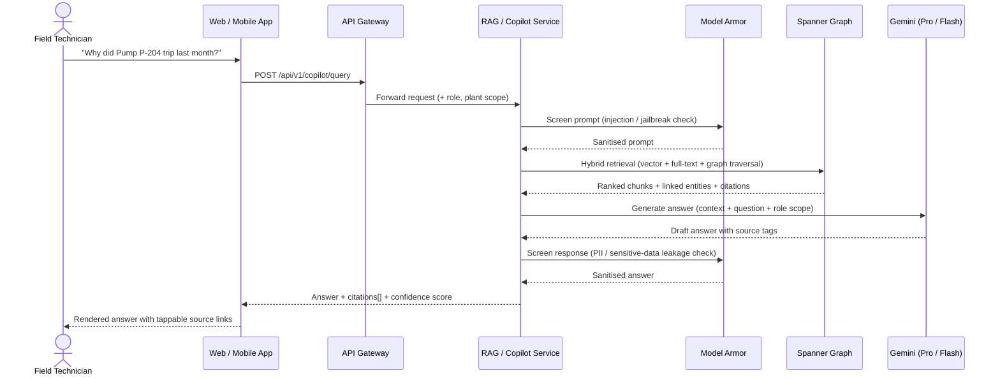
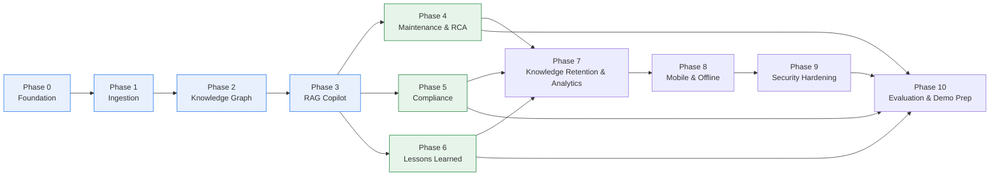
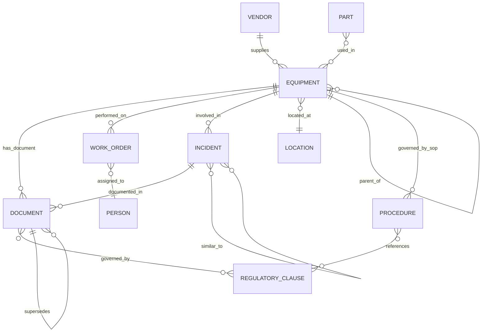

# Product Requirements Document: UnifyOps - AI Industrial Knowledge Intelligence Platform

**ET AI Hackathon 2026 - Problem Statement 8: AI for Industrial Knowledge Intelligence: Unified Asset & Operations Brain**

| | |
|---|---|
| **Document Type** | Engineering & Product PRD (build-ready) |
| **Product Codename** | UnifyOps (Hindi: "bridge" - the platform bridges fragmented plant knowledge into one substrate) |
| **Version** | 1.0 |
| **Status** | Approved for build |
| **Audience** | AI coding agents, software engineers, technical leads implementing this project |
| **Cloud Platform** | Google Cloud Platform (GCP) - exclusively |
| **Deliverable Format** | Working Prototype, Architecture Diagram, Presentation Deck, Demo Video |

---

## 1. Executive Summary

UnifyOps is an AI-powered Industrial Knowledge Intelligence platform built entirely on Google Cloud that ingests every category of document a heavy-industrial plant produces - engineering drawings and P&IDs, maintenance work orders, safety procedures, inspection reports, operating instructions, incident reports, and regulatory filings - and turns them into a single, continuously-updating knowledge graph. On top of that one substrate, UnifyOps runs four distinct intelligence layers: a cited, conversational **Expert Knowledge Copilot**; a **Maintenance Intelligence & RCA Agent**; a **Quality & Regulatory Compliance Intelligence** layer; and a **Lessons Learned & Failure Intelligence Engine**. Each layer is a different lens over the same graph, not a separate system - which is the core architectural bet of this PRD.

The platform directly answers the problem statement's central claim: Indian industrial plants don't have a technology-absence problem, they have a fragmentation problem - 7 to 12 disconnected document systems per large plant, 35% of working hours spent searching for information that already exists somewhere, an approaching retirement cliff that will take undocumented judgment out the door with it. UnifyOps is designed to be demoable as a working, end-to-end prototype within a hackathon timeline while remaining structurally honest about what is hackathon-scope versus what is a credible post-hackathon roadmap - every feature in this document is tagged **[MVP]**, **[Demo Extension]**, or **[Post-Hackathon Roadmap]** so the engineering team always knows what "done for the deadline" actually means.

This PRD is intentionally exhaustive. It is written to be handed directly to an AI coding agent (e.g. Claude Code) and a human engineering team working in parallel, with every feature specified to the level of testable functional requirements, explicit GCP service bindings, and concrete acceptance criteria - so that "is this feature done" never depends on a conversation, only on the document.

## 2. Problem Statement Recap

**Theme:** Industrial Intelligence / Document Management / Knowledge Engineering / Quality

**The core problem, in one paragraph:** Asset-intensive Indian industrial organisations run on 7–12 disconnected document systems per plant - drawings in one place, work orders in another, procedures in a third, inspections in a fourth, regulatory filings scattered across email. Professionals lose roughly a third of their working hours searching for or recreating information that already exists somewhere in the organisation. This fragmentation is not a filing inconvenience - it is a documented contributor to unplanned downtime, and it compounds every year as a quarter of India's experienced industrial engineers approach retirement, taking undocumented operational judgment with them permanently.

**The challenge statement, restated as a build target:** ingest heterogeneous industrial documents across structured and unstructured formats, extract their entities into a unified knowledge graph that keeps itself current as new records arrive, and make the collective intelligence of that graph queryable, actionable, and continuously updated - across any device, for any function in the plant, from a field technician's phone to a plant head's leadership dashboard.

**The five capability pillars named in the problem statement**, each of which this PRD maps to a dedicated phase group:
1. **Universal Document Ingestion & Knowledge Graph Agent** → Phases 1–2
2. **Expert Knowledge Copilot** (RAG, cited, mobile-first) → Phase 3
3. **Maintenance Intelligence & RCA Agent** → Phase 4
4. **Quality & Regulatory Compliance Intelligence** → Phase 5
5. **Lessons Learned & Failure Intelligence Engine** → Phase 6

**Official evaluation focus** (from the problem statement - this PRD's success metrics in Section 14 map directly onto these): entity extraction accuracy across document types; query answer quality on domain-expert benchmark questions; knowledge graph linkage completeness; time-to-answer versus traditional search; compliance gap detection accuracy; demonstrated improvement in cross-functional knowledge discovery.

**Official judging criteria:** Innovation (25%), Business Impact (25%), Technical Excellence (20%), Scalability (15%), User Experience (15%).

## 3. Vision & Measurable Objectives

**Vision statement:** Every person on the plant floor - from a field technician troubleshooting a pump at 2am to a plant head reviewing quarterly risk exposure - should be able to ask a plain-language question and get a trustworthy, cited, role-appropriate answer drawn from the plant's entire documented history, in seconds, on whatever device they have in hand.

UnifyOps's objectives are written as measurable targets so that "did we succeed" is never a matter of opinion. Each objective is deliberately mapped to one of the problem statement's own evaluation-focus criteria.

| ID | Objective | Target | Maps to Evaluation Focus |
|---|---|---|---|
| **O1** | Reduce time-to-answer for operational/engineering questions versus traditional document search | ≥ 70% reduction in median time-to-answer | "time-to-answer versus traditional search" |
| **O2** | Accurately classify and extract structured entities from every core document type | ≥ 90% document classification accuracy; ≥ 90% entity extraction F1 | "entity extraction accuracy across document types" |
| **O3** | Produce correct, well-cited answers to real domain-expert questions | ≥ 85% of benchmark questions rated correct and properly cited by a domain reviewer | "query answer quality on domain-expert benchmark questions" |
| **O4** | Build a knowledge graph where entities are correctly linked, not just extracted | ≥ 90% entity-resolution precision and recall on a labelled duplicate-equipment benchmark | "knowledge graph linkage completeness" |
| **O5** | Detect real compliance gaps between regulation and documented plant practice | ≥ 85% precision and recall on a labelled clause/procedure compliance benchmark | "compliance gap detection accuracy" |
| **O6** | Demonstrate the platform is used, and useful, across roles - not just by one function | Query activity logged and attributable across at least 4 distinct personas/roles during the demo period, with role-specific value evidenced per persona | "demonstrated improvement in cross-functional knowledge discovery" |

## 4. Personas

Every feature in this PRD is written with a specific persona's need in mind, and every phase's summary table (Section 10.1) names which persona it primarily serves. Six personas recur throughout:

| Persona | Role | Primary Need | Device Context |
|---|---|---|---|
| **Rajesh** | Field Maintenance Technician | Fast, trustworthy answers about the specific equipment in front of him, often one-handed, sometimes with poor connectivity | Mobile phone, field conditions, gloves, variable signal |
| **Priya** | Reliability / Maintenance Engineer | Full equipment history and failure patterns to diagnose recurring problems and plan proactive maintenance | Desktop and tablet, plant office and floor |
| **Anita** | Quality & Regulatory Compliance Officer | Confidence that current procedures actually satisfy current regulation, and audit-ready evidence when they're asked to prove it | Desktop, periodic audit-prep crunches |
| **Vikram** | Senior/Veteran Engineer (approaching retirement) | A way to externalise 25+ years of undocumented judgment before it leaves with him | Desktop, low tolerance for high-friction documentation tools |
| **Deepak** | Knowledge/Platform Administrator | Visibility into what's flowing through the ingestion pipeline, and a way to fix what the AI gets wrong before it becomes "ground truth" | Desktop, admin console |
| **Mr. Iyer** | Plant Head / Leadership | A synthesized, cross-functional view of operational risk, compliance exposure, and knowledge health - not a query interface | Desktop/tablet, dashboard-first |

## 5. Scope & Out-of-Scope

### 5.1 In Scope (Hackathon Build)

- Ingestion and knowledge-graph construction for the seven core document types named in the problem statement: engineering drawings/P&IDs, maintenance work orders, safety procedures/SOPs, inspection reports, operating instructions, incident/near-miss reports, and regulatory documents.
- A fully functional Expert Knowledge Copilot (Phase 3) with citations, confidence scoring, and role-based access.
- At least one working, demoable feature from each of the three agentic intelligence pillars - Maintenance/RCA (Phase 4), Compliance (Phase 5), Lessons Learned (Phase 6) - sufficient to prove the "one substrate, many lenses" architecture, not necessarily every feature listed in those phases.
- Full evaluation and benchmarking harness (Phase 10) producing real numbers against Objectives O1–O6.
- A responsive web application usable on both desktop and mobile viewports (a installed native app and full offline mode are Post-Hackathon Roadmap - see Phase 8).

### 5.2 Explicitly Out of Scope for the Hackathon Build

- **Live IoT/SCADA/sensor integration.** Phase 4's predictive maintenance signals are derived from *documented* maintenance history (work orders, inspections), not live telemetry. This is a deliberate scope boundary, not an oversight - it keeps the build honest about what it can prove versus claim.
- **Comprehensive national/state regulatory corpus.** Phase 5 ingests a curated, representative regulatory sample (a real subset of Factory Act / OISD / PESO / environmental clauses) sufficient to demonstrate the compliance-mapping mechanism convincingly - not an exhaustive national regulatory database, which is a multi-year data-licensing and legal-review effort beyond hackathon scope.
- **Native mobile apps (iOS/Android).** The mobile experience is a responsive Progressive Web App (Phase 0.3, Phase 3.1). True native apps with offline-first sync (Phase 8) are Post-Hackathon Roadmap.
- **Multi-region disaster recovery.** The hackathon build runs single-region (Section 7.5); DR posture (Phase 9.5) is Post-Hackathon Roadmap.
- **CMMS/ERP system integration.** UnifyOps ingests documents *exported from* such systems (e.g. a work-order PDF/CSV export) rather than building live bidirectional integrations with specific vendor CMMS/ERP platforms during the hackathon.

### 5.3 Priority Tiers Used Throughout This Document

- **[MVP]** - required for the hackathon submission; the mandatory spine plus at least one feature per demo-breadth phase.
- **[Demo Extension]** - strengthens Phases 4–6 if time allows; not required, but each is feasible within a hackathon timeline if the MVP spine is done early.
- **[Post-Hackathon Roadmap]** - written to full engineering depth for continuity and to demonstrate scalability thinking to judges, but explicitly not required for the submission.

## 6. Guiding Principles

These six principles are referenced by name throughout the rest of this PRD, and any engineer or AI agent implementing a feature should resolve ambiguity by checking it against these principles first.

1. **One substrate, many lenses.** There is exactly one knowledge graph. The Copilot, the RCA agent, the Compliance agent, and the Lessons Learned agent are four different queries and four different presentations over the *same* underlying data - never four separate pipelines that happen to share a name. If a feature seems to need its own private data store, that is a signal to reconsider the design, not a green light.
2. **Never silently guess.** Any AI-generated classification, extraction, merge, or conclusion below a defined confidence threshold goes to a human review queue. It is never auto-committed to the graph as ground truth. This applies to entity resolution (Phase 2.2), compliance gap conclusions (Phase 5.2), and RCA drafts (Phase 4.3) alike.
3. **Every answer is traceable.** No answer, score, or flag is presented to a user without a citation back to the specific source document and location it came from. An uncited claim is a defect, not a stylistic choice.
4. **Field-first, not desktop-first-then-adapted.** Every user-facing feature is designed to work on a mobile viewport from the start (Phase 0.3), because Rajesh's context - gloves, poor signal, one hand occupied - is the hardest constraint, and a desktop-first design that is "made responsive" later routinely fails that constraint.
5. **Walking skeleton before features.** Phase 0 exists to get a real, deployed, end-to-end system (empty of business logic) live before any feature work starts, so that the first real feature is built on a foundation that already works, not one that's theorized.
6. **GCP-native, not cloud-agnostic.** Every architectural decision in this PRD assumes Google Cloud as the exclusive platform, per explicit product direction. Where a well-known cloud-agnostic pattern (e.g. a generic message queue) has a more tightly-integrated GCP-native equivalent (e.g. Pub/Sub + Eventarc), this PRD chooses the GCP-native option, because tighter integration reduces the engineering surface area a hackathon team has to build and debug.

---

## 7. System Architecture

### 7.1 High-Level Architecture



**Reading the diagram:** solid arrows are synchronous/primary data-flow calls; dotted arrows are secondary flows (analytics export, observability). Every Cloud Run service in the Application Layer ultimately reads from or writes to Spanner Graph - this is Guiding Principle 1 ("one substrate, many lenses") made literal in the architecture, not just asserted in prose.

### 7.2 RAG Query Sequence (Expert Knowledge Copilot)

This sequence underpins Phase 3 and is reused, with different downstream logic, by every agent added in Phases 4–6.



Two Model Armor checkpoints matter here for different reasons. The **input** check exists because ingested documents (Phase 1) include third-party regulatory PDFs and vendor manuals UnifyOps does not control - a maliciously-crafted document could otherwise attempt an indirect prompt injection against the Copilot. The **output** check exists because generated responses may inadvertently surface personnel names or other sensitive fields pulled from work orders; Model Armor and Sensitive Data Protection catch this before it reaches the user (Section 12).

### 7.3 Phase Dependency Map



Blue = the mandatory hackathon spine. Green = the demo-breadth phases, each of which should contribute at least one **[MVP]**-tagged feature to the submission. Everything downstream of them is Post-Hackathon Roadmap.

### 7.4 Deployment Topology

- **Primary region:** `asia-south1` (Mumbai), for data-residency alignment with Indian regulatory expectations and lowest latency to Indian plant sites.
- **DR region:** `asia-south2` (Delhi) - a multi-region Spanner configuration and cross-region Cloud Storage replication are the Post-Hackathon Roadmap DR posture (Phase 9.5); the hackathon build runs single-region for cost and simplicity.
- **Environments:** `dev`, `staging`, `prod` as three separate GCP projects under one GCP Folder, promoted via Cloud Deploy delivery pipelines (Phase 0.2).
- **Networking:** all Cloud Run services sit behind a Serverless VPC Access connector into a shared VPC; Spanner, Firestore, and Cloud Storage are reached over Private Google Access; VPC Service Controls define a security perimeter around the data layer (Phase 9.3).

---

## 8. Technology Stack

Every layer of UnifyOps maps to a specific GCP service. Where two viable GCP options exist, both are listed with a recommendation and trade-off, so the engineering team can decide based on credit budget and team familiarity.

### 8.1 Client & Presentation Layer

| Component | GCP Service | Notes |
|---|---|---|
| Web application | Cloud Run (containerised Next.js) + Firebase Hosting for static assets | Firebase Hosting for static/SSG assets, Cloud Run for SSR/API routes |
| Mobile experience | Progressive Web App (same React codebase) + service worker | Avoids a second codebase for the hackathon; see Phase 8 for full offline design |
| Admin console | Same app, role-gated routes | No separate deployment needed |
| Global CDN / SSL | Cloud CDN + Google-managed SSL certificates | Fronts both Firebase Hosting and Cloud Run |

### 8.2 Application & Orchestration Layer

| Component | GCP Service | Notes |
|---|---|---|
| Microservices runtime | Cloud Run | One service per bounded context (Section 7.1); scales to zero, container-native |
| API front door | API Gateway (behind Cloud Load Balancing + Cloud Armor) | Central auth check, rate limiting, request routing |
| Event-driven triggers | Eventarc + Pub/Sub | Fires the ingestion pipeline on Cloud Storage upload; fans out notifications |
| Multi-step pipeline orchestration | Cloud Workflows | Sequences the ingestion pipeline (classify → OCR → extract → embed → graph-populate) with retry/branching logic |
| Background/batch jobs | Cloud Run jobs + Cloud Scheduler | Nightly re-indexing, compliance re-scans, digest emails, benchmark harness runs |

### 8.3 AI / ML Layer - Vertex AI (Gemini Enterprise Agent Platform)

| Component | GCP Service | Notes |
|---|---|---|
| Foundation models | Gemini Pro (complex reasoning: RCA synthesis, compliance mapping), Gemini Flash (high-volume: chat, classification), Gemini Flash-Lite (cheap/fast: routing, simple extraction) | Tiered model selection by task complexity is a deliberate cost control (Section 11.6) |
| Document understanding | Document AI - Enterprise Document OCR, Form Parser, Layout Parser, Custom Extractor, Custom Classifier/Splitter | Layout Parser combines OCR with layout understanding for structure-aware, RAG-ready chunking (headings, tables, reading order preserved) |
| Embeddings | Vertex AI text embedding model, consistent 768-dim vectors | Used consistently across Spanner Graph's native vector index |
| Vector search | Spanner Graph's native vector index (primary) - Vertex AI Vector Search as an optional standalone store if a second index is ever needed | Spanner Graph's built-in vector + full-text search covers the MVP without standing up a second vector store |
| Managed RAG orchestration | Retrieval orchestrated directly against Spanner Graph from the RAG/Copilot Service, using Vertex AI's grounding and embedding APIs | Keeps retrieval tied directly to the graph corpus rather than a separate managed RAG product, for the tightest possible integration with Guiding Principle 1 |
| Agent framework | Agent Development Kit (ADK) - open-source, code-first, deployed to a managed agent runtime | Used for the multi-agent logic in Phases 4–6 (RCA, Compliance, Lessons Learned agents) |
| Inter-agent communication | Agent-to-agent tool calling via ADK | Lets the Compliance agent call the Copilot's retrieval tool, the RCA agent call the Lessons Learned agent, etc., without tight coupling |
| LLM firewall | Model Armor | Screens every prompt/response for injection attacks, jailbreaks, and sensitive-data leakage; sits in front of every LLM call (Sections 7.2, 12) |
| Regional language support | Cloud Translation API | Hindi, Marathi, Tamil, Kannada, and other regional languages for field-facing surfaces (Phase 7.4) |
| Voice interface | Speech-to-Text and Text-to-Speech APIs | Hands-free field queries (Phase 8.2) |

### 8.4 Data Layer

| Component | GCP Service | Notes |
|---|---|---|
| Raw document lake | Cloud Storage (regional, lifecycle rules to Nearline/Coldline for aged raw files) | Source of truth for original files; never mutated post-upload |
| Knowledge graph + vector + full-text search | **Spanner Graph** (ISO GQL interface, unified with SQL, native vector and full-text search) | **Primary recommendation.** One database serves graph traversal, semantic search, and keyword search - directly eliminates the "separate feature store" problem that plagues most RAG stacks |
| *Alternative to Spanner Graph* | AlloyDB for PostgreSQL with pgvector + a junction-table graph model | Lower cost of entry and SQL-familiar for teams less comfortable with GQL; models relationships as foreign keys instead of native graph traversal. Recommended fallback if Spanner Graph's pricing tier is a constraint during the hackathon |
| Application/session state, offline sync | Firestore | Native offline persistence SDK is why Firestore - not Cloud SQL - backs the mobile PWA's sync layer (Phase 8.1) and session state (Phase 3.6) |
| Analytics warehouse | BigQuery | Usage analytics, KPI/judging-metric computation (Phase 10), cost/ops reporting |

### 8.5 Identity, Security & Governance

| Component | GCP Service | Notes |
|---|---|---|
| End-user identity & RBAC | Identity Platform (Firebase Authentication) with custom claims (`role`, `plant_id`, `department`) | Backs both web and mobile sign-in |
| Service-to-service identity | Cloud IAM with per-service service accounts, least-privilege roles | No shared "god" service account across microservices |
| Network perimeter | VPC Service Controls around the data layer | Prevents data exfiltration even from a compromised service account (Phase 9.3) |
| Encryption | Cloud KMS with customer-managed encryption keys (CMEK) on Cloud Storage, Spanner, Firestore | Section 12.3 |
| Sensitive data discovery/redaction | Sensitive Data Protection (DLP) - built-in infoType detectors, redaction/masking/tokenisation | Scans ingested documents for PII before they are indexed (Phase 9.1) |
| AI-specific firewall | Model Armor | See Section 8.3 |
| Secrets | Secret Manager | API keys, DB credentials, webhook secrets |
| Audit trail | Cloud Audit Logs | Every read of a compliance-sensitive record and every AI-generated recommendation is logged with actor, timestamp, and reason (Section 12.4) |

### 8.6 DevOps & Observability

| Component | GCP Service | Notes |
|---|---|---|
| CI/CD | Cloud Build triggers on push → Artifact Registry → Cloud Deploy progressive delivery to Cloud Run | dev → staging → prod promotion gates |
| Infrastructure as Code | Terraform (Google provider) | All GCP resources defined declaratively; no console-clicked infrastructure |
| Container registry | Artifact Registry | |
| Observability | Cloud Monitoring, Cloud Logging, Cloud Trace, Error Reporting | Unified dashboards per microservice; SLO burn-rate alerting |
| Cost governance | Cloud Billing budgets & alerts, per-project quotas | Section 11.6 |

### 8.7 Suggested-Technology Coverage Check

Cross-checking against the problem statement's own "Suggested Technologies" list confirms full coverage:

| Suggested technology | Covered by |
|---|---|
| RAG over heterogeneous industrial document corpora | Phase 3 - retrieval against Spanner Graph |
| Knowledge Graphs & industrial ontology engineering | Phase 2, Spanner Graph + Section 9 ontology |
| Computer Vision (P&ID parsing, drawing digitisation) | Phase 1.4, Document AI Custom Extractor + Gemini multimodal understanding |
| OCR & Document Intelligence | Phase 1.3, Document AI Enterprise OCR + Layout Parser |
| QMS Integration | Phase 5 (compliance/quality mapping), Phase 4 (maintenance QMS signals) |
| Agentic AI for maintenance and compliance workflows | Phases 4, 5, 6 - ADK-based agents |

---

## 9. Data Model & Knowledge Graph Ontology

### 9.1 Design Approach

UnifyOps's ontology is deliberately small and extensible rather than exhaustively modelled up front - entity resolution against a messy ontology is a bigger risk to hackathon timelines than an incomplete one. Phase 2 ships with the core entity types below; Phase 7 (Post-Hackathon Roadmap) revisits ontology extension as a self-service admin capability.

### 9.2 Core Entity Types

| Entity | Key Properties | Populated By |
|---|---|---|
| **Equipment** | `tag`, `type`, `manufacturer`, `model`, `install_date`, `criticality`, `parent_equipment_id`, `aliases[]` | Phase 1 extraction, Phase 2 resolution |
| **Document** | `doc_id`, `type` (SOP / Drawing / WorkOrder / Inspection / Incident / Regulatory / Manual), `version`, `upload_date`, `source`, `language`, `status` | Phase 1 ingestion |
| **Location** | `plant`, `unit`, `zone`, `geo_reference` | Phase 1 extraction |
| **Person** (role-level, not individually identifying beyond what a work order legitimately requires) | `role`, `department`, `plant_id` | Phase 1 extraction, scoped by Section 12.2 |
| **Procedure / SOP** | `procedure_id`, `title`, `version`, `governing_equipment[]` | Phase 1 extraction |
| **Incident / NearMiss** | `incident_id`, `severity`, `date`, `root_cause_summary`, `contributing_conditions[]` | Phase 1 ingestion, Phase 6 enrichment |
| **WorkOrder** | `wo_id`, `type`, `status`, `equipment_id`, `assigned_role`, `failure_mode`, `downtime_hours` | Phase 1 ingestion, Phase 4 enrichment |
| **RegulatoryClause** | `clause_id`, `source` (Factory Act / OISD / PESO / Environmental), `text_summary` | Phase 1 ingestion, Phase 5 mapping |
| **Part / Spare** | `part_id`, `name`, `compatible_equipment[]` | Phase 1 extraction |
| **Vendor / OEM** | `vendor_id`, `name`, `supplied_equipment[]` | Phase 1 extraction |
| **FailurePattern** | `pattern_id`, `failure_mode`, `typical_contributing_factors[]`, `typical_corrective_actions[]` | Phase 4.5 |
| **LessonPattern** | `lesson_id`, `shared_factor`, `trigger_condition`, `contributing_incidents[]` | Phase 6.2 |

### 9.3 Core Relationships



### 9.4 Representative GQL Query

Illustrates why Spanner Graph's native GQL is well suited to this ontology - a single query answers "what work has been done on equipment governed by a specific SOP, and were any of those work orders linked to an incident?":

```
GRAPH IndustrialGraph
MATCH (p:Procedure {procedure_id: 'SOP-COKE-OVEN-14'})<-[:GOVERNED_BY_SOP]-(e:Equipment)
      <-[:PERFORMED_ON]-(w:WorkOrder)
OPTIONAL MATCH (w)-[:PERFORMED_ON]->(e)<-[:INVOLVED_IN]-(i:Incident)
RETURN e.tag, w.wo_id, w.status, i.incident_id, i.severity
```

### 9.5 Entity Resolution Strategy

The same physical pump is routinely tagged inconsistently across systems ("P-204", "Pump-204", "P204-A"). Phase 2.2 handles this with a three-tier approach: (1) deterministic normalisation (case, punctuation, known abbreviation expansion), (2) fuzzy/embedding-similarity matching with a confidence threshold, and (3) a human review queue for anything below that threshold - never a silent auto-merge on a low-confidence match, per Guiding Principle 2.

---

## 10. Implementation Roadmap Overview

### 10.1 Phase Summary

| Phase | Name | Priority Tier | Primary Persona(s) | Key Question It Answers |
|---|---|---|---|---|
| 0 | Foundation, GCP Landing Zone & Platform Bootstrap | **MVP - build first** | Deepak | "Is there a live, secure, deployable system to build on?" |
| 1 | Universal Document Ingestion & Processing Pipeline | **MVP** | Deepak, all personas indirectly | "Can every document type get in, cleanly?" |
| 2 | Industrial Knowledge Graph & Ontology Engine | **MVP** | Deepak, Priya | "Are the documents connected to the equipment, people, and rules they relate to?" |
| 3 | Semantic Search & Expert Knowledge Copilot (RAG) | **MVP** | Rajesh, Priya | "Can anyone ask a question in plain language and get a trustworthy, cited answer?" |
| 4 | Maintenance Intelligence & RCA Agent | Demo Extension (with MVP core) | Priya, Rajesh | "Why did it fail, and what should we do about it?" |
| 5 | Quality & Regulatory Compliance Intelligence | Demo Extension (with MVP core) | Anita | "Where are we exposed, before the auditor finds it?" |
| 6 | Lessons Learned & Failure Intelligence Engine | Demo Extension (with MVP core) | Anita, Priya, Vikram | "Have we seen this pattern before, and did we warn anyone?" |
| 7 | Knowledge Retention, Notifications & Analytics | Post-Hackathon Roadmap | Vikram, Mr. Iyer | "Are we capturing what's about to walk out the door, and does leadership see the whole picture?" |
| 8 | Mobile, Offline & Multi-Modal Field Experience | Post-Hackathon Roadmap | Rajesh | "Does it still work when the technician has no signal and gloves on?" |
| 9 | Security, Governance & Platform Hardening | Post-Hackathon Roadmap (three items pulled forward to MVP) | Deepak | "Is this safe to put real plant data into?" |
| 10 | Evaluation, Benchmarking & Hackathon Deliverables | **MVP - final block** | All (for judging) | "Can we prove, with numbers, that this works?" |

### 10.2 How to Read Each Phase

Every feature below follows the same template:

- **Description** - what it is and why it exists.
- **Key Capabilities** - the concrete things a user or downstream system can do because this feature exists.
- **Functional Requirements** - numbered, testable statements (`FR-<phase>.<feature>.<n>`).
- **GCP Implementation** - the exact services and how they're wired together.
- **Acceptance Criteria** - the bar for "done," phrased as Given/When/Then.
- **Dependencies** - what must exist first.

Every feature carries a priority tag: **[MVP]**, **[Demo Extension]**, or **[Post-Hackathon Roadmap]**, as defined in Section 5.3.

---

## Phase 0 - Foundation, GCP Landing Zone & Platform Bootstrap

**Goal of this phase:** by the end of Phase 0 there is a live URL, a working login, a backend health-check round trip, and a CI/CD pipeline that deploys on every push - with no business logic built yet. This is the "walking skeleton" from Guiding Principle 5.

### 0.1 GCP Landing Zone, Project Structure & IAM Foundation **[MVP]**

**Description:** Establishes the GCP organisational structure - projects, folders, billing, and baseline IAM - that every later phase builds inside.

**Key Capabilities:** separate `UnifyOps-dev` / `UnifyOps-staging` / `UnifyOps-prod` projects under a shared folder; baseline IAM groups mapped to predefined roles rather than per-person grants; a billing budget configured before any AI API is called.

**Functional Requirements:**
1. FR-0.1.1: All three environments exist as separate GCP projects with a documented project-ID naming convention.
2. FR-0.1.2: No human account holds `Owner` or `Editor` at the project level in staging/prod; access is via IAM groups with least-privilege roles.
3. FR-0.1.3: A billing budget alert fires at 50%, 90%, and 100% of allocated GCP credit.
4. FR-0.1.4: Required APIs (`run.googleapis.com`, `aiplatform.googleapis.com`, `documentai.googleapis.com`, `spanner.googleapis.com`, `storage.googleapis.com`, `firestore.googleapis.com`, `modelarmor.googleapis.com`, etc.) are enabled via Terraform, not the console.

**GCP Implementation:** Resource Manager (Projects/Folders), Cloud Billing, Cloud IAM, Terraform `google` provider.

**Acceptance Criteria:**
- ✅ Given a fresh GCP Organisation, when `terraform apply` runs against the landing-zone module, then all three projects, their IAM bindings, and enabled APIs exist with no manual console steps.
- ✅ Given the billing budget is configured, when spend crosses 50%, then the designated alert channel receives notice within 15 minutes.

**Dependencies:** None - first thing built.

### 0.2 Infrastructure as Code & CI/CD Pipeline **[MVP]**

**Description:** Every GCP resource is defined in Terraform and deployed through Cloud Build - no console-clicked infrastructure once this phase is complete.

**Key Capabilities:** a monorepo (`/services/*`, `/infra/terraform/*`, `/web`) with per-service Dockerfiles; push-to-deploy to `staging`; manual-approval promotion to `prod`; PR builds run tests/build without deploying.

**Functional Requirements:**
1. FR-0.2.1: A Cloud Build trigger exists per service, path-filtered to that service's directory.
2. FR-0.2.2: Every container image is tagged with the Git commit SHA and pushed to Artifact Registry before deployment.
3. FR-0.2.3: Cloud Deploy defines a `dev → staging → prod` pipeline with a manual approval gate before `prod`.
4. FR-0.2.4: Terraform state is stored remotely (GCS backend, versioned) - never local.

**GCP Implementation:** Cloud Build, Artifact Registry, Cloud Deploy, GCS (Terraform state backend), Git host of choice.

**Acceptance Criteria:**
- ✅ Given a merge to `main`, when the pipeline runs, then a new revision is live on `staging` within 10 minutes with zero manual steps.
- ✅ Given a `staging` revision is approved, when the approver clicks approve in Cloud Deploy, then the identical image (not a rebuild) deploys to `prod`.

**Dependencies:** 0.1.

### 0.3 Base Frontend Application Shell **[MVP]**

**Description:** The first deployed, visible artifact of UnifyOps - a responsive app shell with routing, a design-system baseline, and a login screen, live at a real URL before any feature logic exists.

**Key Capabilities:** responsive shell (mobile + desktop breakpoints from day one, per Guiding Principle 4); authenticated/unauthenticated route groups; a persistent nav scaffold with placeholders for every future module.

**Functional Requirements:**
1. FR-0.3.1: The shell deploys to Cloud Run/Firebase Hosting and is reachable over HTTPS with a valid managed certificate.
2. FR-0.3.2: Unauthenticated users are redirected to sign-in; authenticated users land on a placeholder dashboard.
3. FR-0.3.3: The shell renders correctly at a 380px mobile viewport and a 1440px desktop viewport with no horizontal scroll.

**GCP Implementation:** Cloud Run/Firebase Hosting, Cloud CDN, Identity Platform (wired fully in 0.4/0.6).

**Acceptance Criteria:**
- ✅ Given the deployed URL, when any person visits it, then they see a real, branded, responsive shell - not a framework starter page.

**Dependencies:** 0.2.

### 0.4 Base Backend API Gateway & Microservice Skeleton **[MVP]**

**Description:** Stands up the eight Cloud Run microservices (Section 7.1) as empty-but-deployed skeletons, each exposing `/healthz`, wired behind one API Gateway.

**Key Capabilities:** consistent per-service scaffold (logging, error handling, request-ID propagation); Gateway routes by path prefix.

**Functional Requirements:**
1. FR-0.4.1: All eight services (Ingestion, Graph, RAG, Maintenance, Compliance, Lessons Learned, Notification, Admin) deploy to Cloud Run and respond `200 OK` on `/healthz`.
2. FR-0.4.2: API Gateway correctly routes a test request to each service by path.
3. FR-0.4.3: Every request gets a correlation/request ID at the Gateway, propagated through to Cloud Logging downstream.

**GCP Implementation:** Cloud Run (×8), API Gateway, Cloud Load Balancing, Cloud Armor (basic rate-limit rule from day one).

**Acceptance Criteria:**
- ✅ Given the deployed Gateway URL, when a request hits any of the eight documented path prefixes, then it is routed correctly and a `200` health response returns end-to-end.

**Dependencies:** 0.2.

### 0.5 Observability Foundation **[MVP]**

**Description:** Wires every microservice into a shared observability baseline before there is meaningful traffic to observe.

**Key Capabilities:** structured JSON logging correlated by request ID; a single Cloud Monitoring dashboard per-service; baseline uptime checks and alert policies.

**Functional Requirements:**
1. FR-0.5.1: Every service emits structured logs including `severity`, `request_id`, `service_name`, `latency_ms`.
2. FR-0.5.2: A Cloud Monitoring dashboard shows all eight services' health at a glance.
3. FR-0.5.3: An alert fires if any service's error rate exceeds 5% over a 5-minute window.

**GCP Implementation:** Cloud Logging, Cloud Monitoring, Cloud Trace, Error Reporting.

**Acceptance Criteria:**
- ✅ Given a deliberately-triggered `500` in any service, when it occurs, then it appears in Error Reporting within one minute with a correlation ID linking it to the originating request.

**Dependencies:** 0.4.

### 0.6 Secrets & Configuration Management **[MVP]**

**Description:** Centralises every credential and environment-specific config so none are hard-coded or committed.

**Key Capabilities:** every service reads config from Secret Manager + injected env vars at deploy time; secrets are versioned.

**Functional Requirements:**
1. FR-0.6.1: No credential, API key, or connection string exists in the Git repository at any commit (enforced by a pre-commit secret-scanning hook plus a Cloud Build verification step).
2. FR-0.6.2: Each Cloud Run service's secrets are granted via a dedicated service account scoped only to the secrets it needs.

**GCP Implementation:** Secret Manager, Cloud IAM, `gitleaks` pre-commit hook + Cloud Build step.

**Acceptance Criteria:**
- ✅ Given a full Git history scan, when run, then zero secrets are found.

**Dependencies:** 0.1.

---

## Phase 1 - Universal Document Ingestion & Processing Pipeline

**Goal of this phase:** every document type named in the problem statement can be dropped into UnifyOps and comes out the other side classified, text-extracted, entity-tagged, and chunk-ready. This delivers the ingestion half of Pillar 1.

### 1.1 Multi-Format Document Upload Interface **[MVP]**

**Description:** The entry point for all content - drag-and-drop web upload, bulk folder/zip upload for initial migration, and an API endpoint for future system-to-system integration.

**Key Capabilities:** drag-and-drop single/multi-file upload with progress indicators; bulk zip/folder upload; optional upload-time metadata hints (plant, unit, doc-type).

**Functional Requirements:**
1. FR-1.1.1: The upload UI accepts PDF, DOCX, XLSX, CSV, PNG, JPEG, TIFF, and common CAD-exchange formats (e.g. DWG/DXF-exported PDF) up to 200MB per file.
2. FR-1.1.2: A bulk zip upload is unpacked server-side and each contained file is queued individually.
3. FR-1.1.3: Every upload is written to Cloud Storage before any processing begins, so the original file is never lost even if downstream processing fails.
4. FR-1.1.4: Upload triggers an Eventarc event that starts the Cloud Workflows ingestion pipeline asynchronously - the uploader is never blocked waiting for OCR/extraction to complete.

**GCP Implementation:** Frontend upload component → signed Cloud Storage URL → direct browser-to-GCS upload → Eventarc trigger on object finalisation.

**Acceptance Criteria:**
- ✅ Given a user selects 50 mixed-format files, when they confirm upload, then all 50 appear in the Ingestion Monitoring Dashboard (1.7) as queued within seconds, without the browser tab needing to stay open.
- ✅ Given a corrupted or password-protected PDF is uploaded, when processing is attempted, then it is flagged with a clear error state rather than silently disappearing.

**Dependencies:** Phase 0 complete.

### 1.2 Document Classification & Routing Engine **[MVP]**

**Description:** Every incoming file is classified by document type before deeper processing, so a P&ID routes to computer-vision extraction and a scanned inspection form routes to Form Parser rather than treating everything identically.

**Key Capabilities:** automatic classification into the seven core document types; confidence-scored routing, with low-confidence classifications flagged for human review rather than mis-routed silently.

**Functional Requirements:**
1. FR-1.2.1: A Document AI Custom Classifier assigns one of the core document types with a confidence score.
2. FR-1.2.2: Classifications below an 80% confidence threshold (configurable) route to the human review queue instead of proceeding automatically.
3. FR-1.2.3: The classification and confidence score are persisted on the `Document` node before further processing.

**GCP Implementation:** Document AI Custom Classifier/Splitter, invoked from the Ingestion Service, orchestrated as a Cloud Workflows step.

**Acceptance Criteria:**
- ✅ Given a labelled benchmark set of 200 documents spanning all seven core types, when classification runs, then overall accuracy is ≥ 90% (feeds Objective O2).

**Dependencies:** 1.1.

### 1.3 OCR & Text Extraction Pipeline **[MVP]**

**Description:** Converts every page - typed, scanned, or handwritten - into machine-readable, structure-aware text, using Document AI's Layout Parser rather than flat OCR, because flat OCR destroys the heading/table/list structure both RAG quality and human readability depend on.

**Key Capabilities:** full-text extraction preserving structure; table detection/extraction; multi-language support for mixed English/regional-language documents; image-quality scoring for degraded scans.

**Functional Requirements:**
1. FR-1.3.1: Every ingested page is processed through Document AI's Enterprise OCR + Layout Parser, yielding structured text with preserved heading/table hierarchy.
2. FR-1.3.2: Tables are extracted as structured key-value/tabular data, not flattened paragraph text.
3. FR-1.3.3: Pages below a defined image-quality threshold (blur, glare, undersized font) are flagged `needs_manual_review` rather than passed downstream with low-confidence text.
4. FR-1.3.4: Extracted text and layout metadata are persisted to Cloud Storage referencing the original raw file.

**GCP Implementation:** Document AI (Enterprise OCR + Layout Parser), Cloud Storage, Cloud Workflows orchestration.

**Acceptance Criteria:**
- ✅ Given a 20-page scanned inspection report of mixed print quality, when processed, then extracted text preserves table/heading structure and low-quality pages are individually flagged rather than failing the whole document.

**Dependencies:** 1.2.

### 1.4 Engineering Drawing & P&ID Digitisation **[MVP: basic tag extraction · Demo Extension: topology graph]**

**Description:** P&IDs are the hardest, most valuable document type to digitise - dense with equipment tags and instrument symbols standard OCR can't interpret, but exactly what the knowledge graph needs to link a drawing to the physical equipment it describes.

**Key Capabilities:** equipment tag extraction from title blocks and inline callouts; symbol recognition via a fine-tuned Custom Extractor; **[Demo Extension]** line/connectivity tracing into a simplified topology graph.

**Functional Requirements:**
1. FR-1.4.1: A Document AI Custom Extractor, fine-tuned on a small labelled set of sample P&IDs, extracts equipment tags with bounding-box location.
2. FR-1.4.2: Extracted tags are matched (via 2.2's entity resolution) against existing `Equipment` nodes rather than creating unchecked duplicates.
3. FR-1.4.3 **[Demo Extension]**: Detected line connections are persisted as candidate `CONNECTS_TO` edges with a confidence score, surfaced for human confirmation rather than auto-committed.

**GCP Implementation:** Document AI Custom Extractor (fine-tuned processor version), Gemini multimodal understanding as a cross-check for uncertain symbols.

**Acceptance Criteria:**
- ✅ Given a sample P&ID with 15 labelled equipment tags, when processed, then at least 12 (80%) are correctly extracted and linked to the corresponding `Equipment` node.

**Dependencies:** 1.3, 2.1.

### 1.5 Metadata & Entity Extraction Engine **[MVP]**

**Description:** Runs across every document type to pull the structured entities that populate the knowledge graph - this is the feature Objective O2's F1 target is measured against.

**Key Capabilities:** ontology-tuned named-entity extraction; cross-reference detection between documents; confidence-scored output feeding the human review queue.

**Functional Requirements:**
1. FR-1.5.1: Gemini Flash, prompted with the Section 9.2 ontology schema and structured-output constraints, extracts entities from every processed document's text.
2. FR-1.5.2: Extracted entities include, at minimum: equipment tags, location references, dates, regulatory clause references, and document cross-references.
3. FR-1.5.3: Each extracted entity carries a confidence score and a source span (character offset) for traceability.
4. FR-1.5.4: Entities below a configurable confidence threshold surface in the human review queue rather than being silently written to the graph.

**GCP Implementation:** Gemini Flash via Vertex AI, structured/JSON output mode constrained to the ontology schema, invoked from the Ingestion Service.

**Acceptance Criteria:**
- ✅ Given the labelled benchmark set, when entity extraction runs, then overall F1 is ≥ 90% (Objective O2).

**Dependencies:** 1.3.

### 1.6 Document Chunking & RAG Preprocessing **[MVP]**

**Description:** Splits processed documents into retrieval-ready chunks that preserve structural context, and generates embeddings - the direct input to Phase 3's retrieval layer.

**Key Capabilities:** structure-aware chunking rather than naive fixed-length splitting; per-chunk embeddings written to Spanner Graph; chunk-to-document-to-entity linkage preserved for citations.

**Functional Requirements:**
1. FR-1.6.1: Each document is split into chunks of roughly 200–500 tokens, with ancestral heading context prepended so a chunk retrieved in isolation still makes sense.
2. FR-1.6.2: Every chunk is embedded via the Vertex AI embedding model and stored alongside the chunk text in Spanner Graph.
3. FR-1.6.3: Every chunk retains a back-reference to its source `Document` node and page/section, so any answer built from it can be cited precisely.

**GCP Implementation:** Chunking logic in the Ingestion Service (post Layout Parser output), embeddings via Vertex AI, storage in Spanner Graph.

**Acceptance Criteria:**
- ✅ Given a processed 40-page SOP, when chunked, then a chunk from page 30 still carries enough heading context to be independently meaningful, and its citation resolves to the exact page/section.

**Dependencies:** 1.3, 1.5.

### 1.7 Ingestion Monitoring Dashboard & Human-in-the-Loop Correction **[MVP: monitoring · Demo Extension: full correction UI]**

**Description:** Gives Deepak visibility into what's flowing through the pipeline, what failed, and a queue of low-confidence extractions needing a human decision before they become graph ground truth.

**Key Capabilities:** real-time per-document pipeline status; **[Demo Extension]** a correction UI to confirm/edit/reject flagged items.

**Functional Requirements:**
1. FR-1.7.1: The dashboard shows, per document, its current pipeline stage, timestamps, and any error/low-confidence flags.
2. FR-1.7.2: Documents flagged `needs_manual_review` appear in a dedicated queue, filterable by flag reason.
3. FR-1.7.3 **[Demo Extension]**: A reviewer can approve, edit, or reject a flagged item directly from the queue; approved corrections write back to the graph, logged with reviewer identity and timestamp.

**GCP Implementation:** Admin Service reading pipeline state from Firestore (real-time status) and Spanner Graph (entity data); frontend on the Phase 0 admin console shell.

**Acceptance Criteria:**
- ✅ Given 100 documents mid-pipeline, when the dashboard is viewed, then every document's current stage is visible without inspecting logs.
- ✅ Given a flagged low-confidence equipment tag, when a reviewer corrects it, then the corrected value - not the original guess - is what the graph and Copilot use.

**Dependencies:** 1.2, 1.3, 1.5.

---

## Phase 2 - Industrial Knowledge Graph & Ontology Engine

**Goal of this phase:** entities extracted in Phase 1 stop being isolated per-document facts and become one connected, continuously-updating graph - Guiding Principle 1 made real. By the end of this phase, "show me everything connected to Pump P-204" returns a real, multi-hop answer.

### 2.1 Knowledge Graph Schema & Property Graph Provisioning **[MVP]**

**Description:** Translates the Section 9 ontology into an actual Spanner Graph property graph definition, managed as code.

**Key Capabilities:** full node/edge schema provisioned via `CREATE PROPERTY GRAPH`; vector and full-text indexes defined in the same migration; schema changes tracked in the same CI pipeline as application code.

**Functional Requirements:**
1. FR-2.1.1: A `CREATE OR REPLACE PROPERTY GRAPH IndustrialGraph` statement defines all core node types and relationships from Section 9.3, applied via a versioned migration script.
2. FR-2.1.2: A vector index (on chunk embeddings) and a full-text search index (on chunk text and key entity fields) are created in the same migration.
3. FR-2.1.3: Schema changes go through the same PR-review/CI process as application code - no direct schema edits against staging/prod.

**GCP Implementation:** Spanner Graph, GQL/DDL migration scripts run via a Cloud Build step, Terraform for the underlying Spanner instance.

**Acceptance Criteria:**
- ✅ Given a fresh `prod` Spanner instance, when the migration pipeline runs, then the full `IndustrialGraph` schema, including vector and full-text indexes, exists and is queryable via GQL.

**Dependencies:** Phase 0 complete.

### 2.2 Entity Resolution & Deduplication Engine **[MVP]**

**Description:** The same physical pump gets tagged inconsistently across source systems. This engine stops UnifyOps's graph from becoming three disconnected nodes for one real piece of equipment - the single highest-leverage feature in the ontology layer, since every downstream agent depends on equipment history being attached to one node, not three.

**Key Capabilities:** deterministic normalisation; embedding-similarity fuzzy matching scoped within the same plant to avoid false cross-plant merges; confidence-scored merge decisions, never a silent auto-merge on an uncertain match.

**Functional Requirements:**
1. FR-2.2.1: Every newly extracted `Equipment` candidate is checked against existing nodes using deterministic normalisation rules before fuzzy matching runs.
2. FR-2.2.2: Unmatched candidates are compared via embedding similarity against existing nodes scoped to the same `Location`; matches above a high-confidence threshold (e.g. ≥ 0.92 cosine similarity plus rule agreement) are auto-merged and logged with both source spans.
3. FR-2.2.3: Matches between low- and high-confidence thresholds are written as `candidate_merge` records surfaced in the 2.5 review queue, not auto-committed.
4. FR-2.2.4: Every merge preserves both original tag strings as `aliases[]` on the resulting node, so future documents using either spelling still resolve correctly.

**GCP Implementation:** Graph Service (Cloud Run) running resolution logic against Spanner Graph, embeddings via Vertex AI.

**Acceptance Criteria:**
- ✅ Given a benchmark set of 50 known-duplicate and 50 known-distinct equipment tag pairs, when resolution runs, then precision and recall are both ≥ 90% (Objective O4).
- ✅ Given a low-confidence candidate merge, when generated, then it appears in the review queue with both source documents linked, and is never written to the graph until a human approves it.

**Dependencies:** 2.1, Phase 1.5.

### 2.3 Automated Relationship Inference & Graph Population Service **[MVP]**

**Description:** Turns per-document entities/cross-references into durable graph edges, and infers indirect relationships (e.g. a work order and an incident sharing an equipment node) that neither document explicitly stated.

**Key Capabilities:** direct relationship creation from explicit extraction output; inferred relationship creation from shared context; idempotent population.

**Functional Requirements:**
1. FR-2.3.1: For every entity extracted in 1.5, the corresponding graph edge is created or confirmed within the same ingestion pipeline run - graph population is a pipeline stage, not a manual step.
2. FR-2.3.2: Inferred `SIMILAR_TO` edges between incidents are proposed based on shared equipment + overlapping failure-mode keywords, with a confidence score, subject to the same review discipline as 2.2.
3. FR-2.3.3: Edge creation is idempotent - reprocessing a document updates existing edges rather than creating duplicates, keyed on `(source_node, edge_type, target_node)`.
4. FR-2.3.4: When a newer document version supersedes an older one (2.6), edges sourced from the superseded version are marked `superseded`, not deleted.

**GCP Implementation:** Graph Service, invoked as the final Cloud Workflows stage after Phase 1.6, writing directly to Spanner Graph.

**Acceptance Criteria:**
- ✅ Given a `WorkOrder` referencing an equipment tag and an assigned role, when ingestion completes, then both `PERFORMED_ON` and `ASSIGNED_TO` edges exist and are traversable via GQL.
- ✅ Given the same document is reprocessed, when the pipeline runs again, then no duplicate edges are created.

**Dependencies:** 2.1, 2.2, Phase 1.5, Phase 1.6.

### 2.4 Knowledge Graph Explorer & Visual Browser **[MVP]**

**Description:** Lets Deepak and Priya see the graph directly - sanity-checking ingestion output and manually exploring equipment history, often faster than a natural-language query when you already know the node you want.

**Key Capabilities:** search-and-focus by equipment tag/document name; expand-on-click multi-hop traversal; a side panel with the full property set and source-document links.

**Functional Requirements:**
1. FR-2.4.1: Searching an `Equipment` tag returns the matching node (respecting 2.2's alias resolution) with its one-hop neighbours.
2. FR-2.4.2: Clicking any neighbour re-centers the view on it and loads its own neighbourhood, supporting incremental multi-hop exploration.
3. FR-2.4.3: A side panel shows every property of the selected node and, for `Document` neighbours, a direct link to the source file.
4. FR-2.4.4: The explorer functions correctly on a tablet viewport with touch-friendly interaction.

**GCP Implementation:** Graph Service exposes a `/graph/neighborhood` endpoint executing scoped GQL `MATCH` queries; frontend rendered with a force-directed graph visualisation library.

**Acceptance Criteria:**
- ✅ Given an equipment tag with 12 connected documents and 3 connected work orders, when a user searches for it, then all 15 neighbours render within 2 seconds, correctly labelled by relationship type.

**Dependencies:** 2.1, 2.3.

### 2.5 Graph Review Queue & Data Quality / Completeness Scoring **[MVP]**

**Description:** The single queue where every low-confidence decision across ingestion and graph layers converges, plus an ongoing completeness score so Deepak sees graph health trending, not just individual flagged items.

**Key Capabilities:** unified review queue filterable by type/plant/age; a nightly-computed "graph completeness score" directly measuring Objective O4; bulk approve/reject.

**Functional Requirements:**
1. FR-2.5.1: All items requiring human review (from 1.2, 1.5, 2.2, 2.3) surface in one queue, tagged with their originating feature and a plain-language reason.
2. FR-2.5.2: A nightly Cloud Run job computes and stores the completeness score (linked entities ÷ total extracted entities) per plant and overall.
3. FR-2.5.3: A reviewer can approve/reject an item in one click, with the decision immediately applied to the graph.
4. FR-2.5.4: The completeness score and queue backlog size are visible on the Admin dashboard as trend lines, not just point-in-time numbers.

**GCP Implementation:** Admin Service reading Firestore (queue state) and Spanner Graph (completeness computation); Cloud Scheduler + Cloud Run job for the nightly score; results also written to BigQuery for Phase 10.

**Acceptance Criteria:**
- ✅ Given a backlog of 40 mixed-type review items, when Deepak opens the queue, then each item shows its origin, reason, and confidence score, and is resolvable without leaving the page.

**Dependencies:** 2.2, 2.3, Phase 1.7.

### 2.6 Incremental Graph Update, Versioning & Document Supersession **[MVP]**

**Description:** Directly implements the problem statement's requirement that the graph "maintains relationships across document types and updates automatically as new records arrive" - including the common case where a revised SOP or drawing must replace an older version without breaking every link pointing at it.

**Key Capabilities:** live automatic graph updates on new documents; explicit supersession handling via a `SUPERSEDES` edge; full version history retained, nothing hard-deleted.

**Functional Requirements:**
1. FR-2.6.1: Uploading a document matching an existing `Document` node's title/type/equipment scope prompts a supersession check (automatic for exact-title matches, human-confirmed for fuzzy matches).
2. FR-2.6.2: A confirmed supersession creates a `SUPERSEDES` edge and marks the old document `status: superseded` (not deleted).
3. FR-2.6.3: By default, Copilot queries retrieve from the latest non-superseded version; a user can explicitly request historical versions.
4. FR-2.6.4: End-to-end time from upload to queryability is tracked on the Admin dashboard as a "freshness" metric.

**GCP Implementation:** Ingestion Service + Graph Service, Cloud Workflows for the supersession-check step, Spanner Graph for the `SUPERSEDES` edge and `status` property.

**Acceptance Criteria:**
- ✅ Given an updated SOP is uploaded, when ingestion completes, then the old SOP is marked superseded (not deleted), a `SUPERSEDES` edge exists, and a Copilot query returns the new version by default.

**Dependencies:** 2.1, 2.3, Phase 1.1.

---

## Phase 3 - Semantic Search & Expert Knowledge Copilot (RAG)

**Goal of this phase:** the knowledge graph becomes directly queryable in plain language by every persona, with every answer cited. This phase delivers the "Expert Knowledge Copilot" pillar in full and is measured most directly by Objectives O1 and O3.

### 3.1 Conversational Copilot Interface (Web + Mobile) **[MVP]**

**Description:** The primary user-facing surface - a chat-style interface, available on desktop and mobile, where any persona types or speaks a question and gets an answer with clickable source links.

**Key Capabilities:** streaming token-by-token response rendering; tappable citation chips opening the exact source page/section; role-aware starter prompts.

**Functional Requirements:**
1. FR-3.1.1: The chat interface streams the answer as generated, with a visible "typing" indicator during retrieval.
2. FR-3.1.2: Every citation renders as a clickable/tappable chip; selecting it opens the source scrolled to the cited page/section.
3. FR-3.1.3: Role-aware starter prompts are shown on an empty query box, pulled from a small per-role prompt library.
4. FR-3.1.4: The interface is fully usable at a 380px mobile viewport with one-handed operation.

**GCP Implementation:** Frontend chat component (Phase 0 app shell) calling the RAG/Copilot Service via streaming HTTP through API Gateway.

**Acceptance Criteria:**
- ✅ Given a query is submitted, when the response streams back, then the first token appears within 2 seconds and every citation chip is independently clickable before the answer finishes streaming.

**Dependencies:** Phase 0.3, Phase 0.4.

### 3.2 Hybrid Retrieval Engine (GraphRAG) **[MVP]**

**Description:** The retrieval core - combines vector search, full-text search, and graph traversal in one retrieval pass, since pure vector similarity misses relationship context and pure graph traversal misses semantic phrasing.

**Key Capabilities:** query understanding that parses entity mentions before retrieval, so "Why did P-204 trip?" retrieves from P-204's neighbourhood, not just semantically similar text anywhere; hybrid ranking; configurable retrieval depth.

**Functional Requirements:**
1. FR-3.2.1: Retrieval combines vector search, full-text search, and graph-proximity signals against the `IndustrialGraph` chunk corpus into a single ranked candidate set per query.
2. FR-3.2.2: Entity mentions detected in the query scope/boost retrieval toward that entity's graph neighbourhood before falling back to corpus-wide semantic search.
3. FR-3.2.3: Retrieved context passed to generation is capped at a token budget appropriate to the selected Gemini model, highest-ranked chunks prioritised within budget.
4. FR-3.2.4: Retrieval latency is logged per request for the Phase 10 benchmark.

**GCP Implementation:** RAG/Copilot Service orchestrating retrieval directly against Spanner Graph, Gemini Flash-Lite for lightweight query-entity parsing ahead of retrieval.

**Acceptance Criteria:**
- ✅ Given a query naming a specific equipment tag, when retrieval runs, then the top-ranked context includes chunks from that equipment's directly linked documents, not only corpus-wide matches.
- ✅ Given the domain-expert benchmark question set (Phase 10.2), when retrieval is evaluated in isolation, then the correct supporting chunk appears in the top-5 results ≥ 90% of the time.

**Dependencies:** Phase 2 complete, 3.1.

### 3.3 Citation & Source Attribution Engine **[MVP]**

**Description:** Structurally enforces Guiding Principle 3 - citations are a byproduct of which chunks were actually used, not requested as an afterthought in the generation prompt, which is a meaningfully weaker guarantee.

**Key Capabilities:** every answer is post-processed to map each claim to its supporting chunk(s); citations resolve to document, page/section, and a deep link; claims with no supporting chunk are flagged, not presented with equal confidence.

**Functional Requirements:**
1. FR-3.3.1: Generation receives retrieved chunks with explicit source IDs, and the model is constrained via structured output to tag each claim with the source chunk ID(s) it drew from.
2. FR-3.3.2: A post-generation validation step confirms every citation tag corresponds to an actually-retrieved chunk ID - a hallucinated citation is rejected and the response regenerated or the unsupported sentence removed.
3. FR-3.3.3: Every displayed citation resolves to `document name + page/section + deep link`, never a generic corpus-level reference.
4. FR-3.3.4: Any answer portion that cannot be tied to a retrieved source with sufficient confidence is visually distinguished ("based on general knowledge, not found in your documents").

**GCP Implementation:** RAG/Copilot Service performs citation validation between the Gemini generation call and the response returned to the client; citation metadata carried alongside chunk records in Spanner Graph (1.6).

**Acceptance Criteria:**
- ✅ Given the domain-expert benchmark set, when answers are reviewed, then zero citations reference a document or page not actually part of the retrieved context.

**Dependencies:** 3.2, Phase 1.6.

### 3.4 Confidence Scoring & Answer Quality Signals **[MVP]**

**Description:** Gives the user an honest signal about how well-grounded an answer is, so a low-confidence answer about a safety-critical procedure is treated with appropriate caution rather than the same visual authority as a well-supported one.

**Key Capabilities:** a per-answer confidence score from retrieval quality and citation coverage; visually distinct low-confidence states prompting consultation with a human expert; thumbs up/down feedback capture.

**Functional Requirements:**
1. FR-3.4.1: A confidence score (0–100) is computed per answer from retrieval-similarity strength and citation coverage ratio, displayed alongside the answer.
2. FR-3.4.2: Answers below a defined threshold are visually flagged (e.g. an amber banner: "Limited supporting documentation found - verify with a supervisor").
3. FR-3.4.3: A thumbs up/down control is attached to every answer; feedback is persisted with the query, answer, and citations.

**GCP Implementation:** Confidence computation in the RAG/Copilot Service; feedback persisted to Firestore, mirrored nightly to BigQuery for Phase 10/Phase 7.3.

**Acceptance Criteria:**
- ✅ Given a query with no strong supporting documents in the corpus, when answered, then the response is visibly flagged as low-confidence rather than presented with unwarranted authority.

**Dependencies:** 3.2, 3.3.

### 3.5 Role-Based Access Scoping for Answers **[MVP]**

**Description:** Not every document is equally visible to every role. Retrieval and generation both respect role scope, rather than relying on the UI alone to hide sensitive results.

**Key Capabilities:** document-level and plant-level access scoping enforced at the retrieval layer, never after the fact; role-aware answer framing.

**Functional Requirements:**
1. FR-3.5.1: Every retrieval query is scoped server-side by the requesting user's `role`, `plant_id`, and `department` claims before candidate chunks are ranked - access control is in the retrieval query itself, not filtered from results afterward.
2. FR-3.5.2: A user querying about a document outside their access scope receives a clear "not accessible" response rather than a silent omission, unless omission is itself a security requirement for that document's classification.
3. FR-3.5.3: Access-scope enforcement is covered by an automated test suite exercising each role against a fixture graph with documents at every classification level.

**GCP Implementation:** RAG/Copilot Service applies IAM-derived claims as GQL query parameters against Spanner Graph; Identity Platform issues custom claims at sign-in.

**Acceptance Criteria:**
- ✅ Given a document scoped to `department: engineering`, when a user without that claim queries about it under any phrasing, then no chunk from that document appears in their retrieved context or final answer.

**Dependencies:** 3.2, Phase 0.6.

### 3.6 Multi-Turn Conversation & Context Management **[MVP]**

**Description:** Real operational questions are rarely one-shot. Keeps the Copilot coherent across a conversation without re-running full retrieval from scratch on every turn.

**Key Capabilities:** conversation history maintained per session, follow-ups resolved against prior context; session persistence across app backgrounding.

**Functional Requirements:**
1. FR-3.6.1: Each conversation gets a session ID; the last N turns (default 6, configurable) are included as context for query understanding and generation.
2. FR-3.6.2: A follow-up query with an ambiguous referent ("what about the backup pump?") resolves against the conversation's entity context before retrieval runs.
3. FR-3.6.3: Sessions persist for at least 24 hours and are resumable from the same device without loss of context.

**GCP Implementation:** Session state in Firestore; RAG/Copilot Service reads session history on each turn.

**Acceptance Criteria:**
- ✅ Given a two-turn conversation where turn 1 asks about Pump P-204 and turn 2 asks "when was it last serviced," when turn 2 is answered, then it correctly refers to P-204 without the user re-stating the tag.

**Dependencies:** 3.1, 3.2.

### 3.7 Query Analytics & Knowledge Gap Detection **[Demo Extension]**

**Description:** Every unanswered or low-confidence query is a signal about what's missing from the corpus. Turns that signal into a visible list for Deepak, closing the loop between "people are asking this" and "we should go get that document."

**Key Capabilities:** a dashboard of most-frequent, most-frequent-low-confidence, and zero-result queries; trending topics by plant/department.

**Functional Requirements:**
1. FR-3.7.1: Every query, its confidence score, and retrieval result count are logged to BigQuery.
2. FR-3.7.2: An analytics view surfaces the top recurring low-confidence/zero-result queries over a rolling 7/30-day window.
3. FR-3.7.3 **[Demo Extension]**: The dashboard suggests a likely missing-document category based on clustering unanswered queries.

**GCP Implementation:** Query logs streamed to BigQuery via the RAG/Copilot Service; Admin dashboard queries BigQuery directly; Gemini Flash-Lite for lightweight query clustering.

**Acceptance Criteria:**
- ✅ Given 30 days of query logs with a recurring unanswered topic, when the dashboard is viewed, then that topic appears in the top-gaps list with its query volume.

**Dependencies:** 3.4, Phase 0.5.

---

## Phase 4 - Maintenance Intelligence & RCA Agent

**Goal of this phase:** prove the same knowledge graph and retrieval substrate can power a structurally different use case - an agent that reasons across failure history rather than answering a single lookup - without rebuilding ingestion or retrieval from scratch.

### 4.1 Work Order & Maintenance History Enrichment **[MVP]**

**Description:** Work orders were already ingested as a core document type in Phase 1; maintenance intelligence needs them structured as a timeline per equipment, built directly from the existing graph.

**Key Capabilities:** a chronological maintenance timeline per `Equipment` node; structured extraction of failure mode, parts replaced, downtime duration beyond general entity extraction.

**Functional Requirements:**
1. FR-4.1.1: A `GET /equipment/{id}/timeline` endpoint returns every linked `WorkOrder`, `Incident`, and inspection `Document`, chronologically ordered.
2. FR-4.1.2: Work order text is additionally parsed for `failure_mode`, `parts_replaced[]`, `downtime_hours`, stored on the `WorkOrder` node.
3. FR-4.1.3: The timeline endpoint supports filtering by date range and event type.

**GCP Implementation:** Maintenance and RCA Service querying Spanner Graph via a GQL path query (Section 9.4 pattern); Gemini Flash for structured field extraction, reusing the 1.5 pattern.

**Acceptance Criteria:**
- ✅ Given an equipment node with 8 work orders and 2 incidents, when the timeline is requested, then all 10 events return chronologically with failure mode and downtime populated wherever present in the source.

**Dependencies:** Phase 2 complete, Phase 1.5.

### 4.2 Predictive Maintenance Signal Engine **[MVP]**

**Description:** Surfaces equipment statistically due for attention based on documented history - recurrence intervals, time-since-last-service, failure-mode clustering - without live sensor/SCADA integration, which is explicitly out of scope (Section 5.2).

**Key Capabilities:** a per-equipment "attention score" from documented history; a ranked "needs attention" list with the specific evidence behind each ranking.

**Functional Requirements:**
1. FR-4.2.1: For every `Equipment` node with at least 2 historical maintenance events, an attention score is computed from documented recurrence interval, time-since-last-service, and incident severity history.
2. FR-4.2.2: The score is always returned with the specific evidence behind it (e.g. "3 bearing failures in 14 months, average interval 4.6 months, 5.2 months since last service") - a bare number with no explanation is treated as a defect, per Guiding Principle 3.
3. FR-4.2.3: A ranked "equipment needing attention" view is available to Priya, filterable by plant/unit.
4. FR-4.2.4: The scoring model is clearly documented as based on documented historical patterns, not live telemetry, in both the UI and this PRD - avoiding overclaiming.

**GCP Implementation:** Maintenance and RCA Service, scoring run as a scheduled Cloud Run job (Cloud Scheduler) over Spanner Graph data, Gemini Pro for synthesising the evidence explanation.

**Acceptance Criteria:**
- ✅ Given a demo equipment set with known synthetic failure patterns, when the attention ranking runs, then the equipment with the tightest, most recent recurrence pattern ranks highest, with correct supporting evidence displayed.

**Dependencies:** 4.1.

### 4.3 Root Cause Analysis (RCA) Agent **[MVP]**

**Description:** The signature agentic feature of this phase - given a failure event, the agent pulls together work-order history, OEM manual guidance, similar prior incidents (via 2.3's `SIMILAR_TO` edges), and inspection findings, and produces a structured, cited RCA draft, rather than a blank page.

**Key Capabilities:** an ADK agent retrieving and synthesising equipment history, OEM guidance, and similar historical incidents; structured 5-Whys-style output, every factor cited; explicitly framed as a draft for human review, never presented as final.

**Functional Requirements:**
1. FR-4.3.1: Given an equipment tag and short failure description, the agent retrieves that equipment's timeline (4.1), any `SIMILAR_TO`-linked prior incidents (2.3), and relevant OEM manual sections (via Phase 3's retrieval engine).
2. FR-4.3.2: The agent produces a structured draft RCA with distinct sections for immediate cause, contributing factors, and recommended corrective actions, each factor citing its source per the 3.3 citation discipline.
3. FR-4.3.3: The draft is explicitly labelled "AI-assisted draft - requires engineer review and sign-off" and cannot be exported/filed as final without a human-recorded approval step.
4. FR-4.3.4: Priya can edit any section before approval; the final approved version and the original AI draft are both retained for audit.

**GCP Implementation:** ADK agent deployed to a managed agent runtime, using Phase 3.2 retrieval as a tool and the Maintenance and RCA Service for equipment-timeline tool calls; Gemini Pro for multi-source synthesis.

**Acceptance Criteria:**
- ✅ Given a documented historical failure with a known root cause (held out of the retrieval corpus), when the agent generates a draft for it, then the draft's contributing factors substantially overlap with the documented actual root cause, as rated by a domain reviewer.
- ✅ Given any generated draft, when viewed, then it is unambiguously labelled pending human sign-off and every contributing factor carries a citation.

**Dependencies:** 4.1, 4.2, Phase 3.2, Phase 3.3, Phase 2.3.

### 4.4 Maintenance Scheduling Optimiser **[Demo Extension]**

**Description:** Extends the attention-score ranking into a proposed schedule, factoring criticality and workshop capacity, so the output is an actionable plan, not just a prioritised list.

**Key Capabilities:** a proposed schedule balancing attention score, criticality, and configurable weekly crew capacity; what-if re-prioritisation.

**Functional Requirements:**
1. FR-4.4.1: Given the ranked attention list, equipment criticality, and configured weekly capacity, the optimiser proposes a schedule assigning equipment to weeks.
2. FR-4.4.2: Manually moving one item re-runs assignment for remaining items, respecting capacity constraints.
3. FR-4.4.3: The proposed schedule is exportable (CSV) for import into the plant's existing CMMS, since full CMMS integration is out of scope.

**GCP Implementation:** Maintenance and RCA Service, an in-service constraint-based scheduling routine (no full solver needed at hackathon scale), Cloud Run.

**Acceptance Criteria:**
- ✅ Given 15 equipment items and a 5-slot weekly capacity, when the schedule is generated, then the highest attention-score/criticality items are assigned to the earliest available weeks without exceeding capacity.

**Dependencies:** 4.2.

### 4.5 Failure Pattern Library & Cross-Equipment Learning **[Demo Extension]**

**Description:** Generalises individual RCA findings into a reusable pattern library, so a recurring failure mode across different equipment is recognised as a known pattern rather than re-derived from scratch - and hands off directly into Phase 6's Lessons Learned engine.

**Key Capabilities:** approved RCA conclusions distilled into a reusable `FailurePattern` record; new RCA drafts check the library first and surface a matching pattern as a starting hypothesis.

**Functional Requirements:**
1. FR-4.5.1: When an RCA draft is approved, the reviewer is prompted to confirm whether it's a new pattern or matches an existing one; confirmed patterns are stored as `FailurePattern` nodes linked to every contributing incident.
2. FR-4.5.2: A new RCA request is checked against the pattern library (via embedding similarity on failure description) before generation; a match is surfaced as prior context.
3. FR-4.5.3: The pattern library is browsable independently of any single RCA, listing each pattern with occurrence count and affected equipment.

**GCP Implementation:** Maintenance and RCA Service, `FailurePattern` node type added to Spanner Graph (2.1 extension), embedding similarity via Spanner Graph's native vector index.

**Acceptance Criteria:**
- ✅ Given a failure pattern already recorded from a prior RCA, when a new similar failure is submitted for a different equipment, then the agent's draft explicitly references the matching pattern and its prior occurrences.

**Dependencies:** 4.3.

---

## Phase 5 - Quality & Regulatory Compliance Intelligence

**Goal of this phase:** the second demo-breadth pillar - mapping regulatory obligations against what the plant's own documents say it actually does, surfacing the gap before an external auditor does. Like Phase 4, this adds no new ingestion or retrieval infrastructure; it is a new lens over the existing graph (Guiding Principle 1).

### 5.1 Regulatory Corpus Ingestion & Clause-Level Mapping **[MVP]**

**Description:** Regulatory text needs to be broken down to individually addressable clauses - not ingested as an undifferentiated PDF - so each clause can be individually mapped against the plant's procedures and equipment state.

**Key Capabilities:** a curated, representative regulatory corpus (Section 5.2) ingested through the Phase 1 pipeline plus a clause-segmentation step; each `RegulatoryClause` node carries source, clause number, and plain-language summary alongside legal text; clauses linked to `Procedure`/`Equipment` nodes by explicit reference or Gemini-assisted topical matching, confidence-scored per Guiding Principle 2.

**Functional Requirements:**
1. FR-5.1.1: Regulatory PDFs are processed through Document AI Layout Parser with an added clause-segmentation step splitting the document into individually addressable `RegulatoryClause` nodes.
2. FR-5.1.2: Each clause is summarised in plain language by Gemini Flash alongside its verbatim legal text, both stored on the node.
3. FR-5.1.3: Clauses are matched to `Procedure`/`Equipment` nodes via topical embedding similarity where no explicit citation exists; matches below a confidence threshold route to Anita's review queue.
4. FR-5.1.4: The demo corpus and its curation boundaries are documented in the Admin console so evaluators understand what subset of regulation is represented.

**GCP Implementation:** Ingestion Service (Phase 1 pipeline, extended), Gemini Flash for summarisation/topical matching, `RegulatoryClause` nodes in Spanner Graph.

**Acceptance Criteria:**
- ✅ Given a 40-clause regulatory sample document, when ingested, then all 40 clauses exist as individually addressable nodes with plain-language summaries, and ≥ 90% of clauses with an explicit in-document citation are correctly linked to their referenced procedure.

**Dependencies:** Phase 2 complete, Phase 1.3.

### 5.2 Compliance Gap Detection Agent **[MVP]**

**Description:** The core agentic capability of this phase - for each mapped clause, checks whether current procedures and equipment records actually satisfy it, flagging a gap with specific, cited evidence when they don't. Targets Objective O5 directly.

**Key Capabilities:** automated clause-by-clause checking (does a governing procedure exist? is it current? do recent inspections show conformance?); every flagged gap includes clause text, specific evidence, and a severity rating; re-runs automatically on any linked procedure/clause change.

**Functional Requirements:**
1. FR-5.2.1: For every `RegulatoryClause` linked to at least one `Equipment`/`Procedure`, the agent evaluates three checks: (a) a governing procedure exists, (b) it is not stale (no update within a configurable review window), (c) linked inspection records within the same window show no unresolved non-conformance.
2. FR-5.2.2: A failed check produces a `ComplianceGap` record with the specific clause, failed check, supporting/absent evidence, and a severity rating derived from the clause's own risk classification where extractable.
3. FR-5.2.3: The agent runs both on a nightly schedule and immediately on any relevant procedure/inspection update (via 2.6), so gaps surface as soon as they're introduced.
4. FR-5.2.4: Every `ComplianceGap` is reviewable by Anita, who can mark it resolved (with a note) or escalate it - the agent flags gaps, it does not unilaterally close them.

**GCP Implementation:** ADK agent using Phase 3.2 retrieval and Spanner Graph as tools; Gemini Pro for the compliance-check reasoning given the need for conservative judgment; triggered via Cloud Scheduler (nightly) and Eventarc (on-change).

**Acceptance Criteria:**
- ✅ Given a labelled benchmark set of clause/procedure pairs with known compliant and known-gapped outcomes, when the agent runs, then precision and recall on gap detection are both ≥ 85% (Objective O5).
- ✅ Given a procedure supersession event, when it occurs, then any newly introduced/resolved gaps reflect within the same ingestion cycle, not only at the next nightly sweep.

**Dependencies:** 5.1, Phase 2.6, Phase 3.2.

### 5.3 Audit Evidence Package Generator **[MVP]**

**Description:** Converts the graph's own documented evidence into the format an external auditor actually wants - a structured, citation-backed package per clause or audit scope - turning what would otherwise be days of manual document-gathering into a generated starting draft.

**Key Capabilities:** given a clause or clause group, assembles clause text, governing procedure, supporting inspection records, and open gap status, each with full citations; exportable to a shareable document.

**Functional Requirements:**
1. FR-5.3.1: Given a selected clause or clause group, the generator assembles clause text, linked governing procedure(s), most recent supporting inspection evidence, and current gap status.
2. FR-5.3.2: Every piece of evidence carries its full citation (document, page/section) per the 3.3 citation discipline.
3. FR-5.3.3: The package is exportable as a formatted document (PDF/DOCX) suitable for direct inclusion in an audit submission.
4. FR-5.3.4: Package generation is logged in the audit trail (Section 12.4) with who requested it and when.

**GCP Implementation:** Compliance Service assembling content from Spanner Graph, Gemini Flash for formatting/summarisation, document export via the same approach used for other generated reports.

**Acceptance Criteria:**
- ✅ Given a clause group with 8 linked clauses, when a package is generated, then the exported document contains all 8 clauses with their evidence and citations, correctly formatted, in under 30 seconds.

**Dependencies:** 5.1, 5.2.

### 5.4 Compliance Dashboard & Deviation Tracking **[Demo Extension]**

**Description:** Gives Anita and Mr. Iyer a standing view of compliance posture - not just a list of gaps, but a trend answering "are we getting better or worse."

**Key Capabilities:** a compliance-by-category heatmap (by regulatory source, plant unit) showing open gap count/severity; a 90-day trend chart.

**Functional Requirements:**
1. FR-5.4.1: A dashboard aggregates open `ComplianceGap` records by regulatory source, plant unit, and severity.
2. FR-5.4.2: A trend chart shows gap open/resolved counts over the previous 90 days.
3. FR-5.4.3: Drilling into any heatmap cell navigates to the filtered list of underlying gaps.

**GCP Implementation:** Compliance Service + Admin Service reading aggregated data from BigQuery (mirrored nightly from Spanner Graph).

**Acceptance Criteria:**
- ✅ Given 90 days of gap history with a mix of open/resolved items, when the dashboard loads, then the trend chart accurately reflects the underlying data, verified against a manual count.

**Dependencies:** 5.2.

---

## Phase 6 - Lessons Learned & Failure Intelligence Engine

**Goal of this phase:** the third demo-breadth pillar - finding the systemic pattern across many individual incident reports that no single review would catch, and pushing it to the people who need to know before the condition recurs. This is the phase most directly aimed at the failure mode described in the problem statement's own context (a warning signal that existed but was never connected to a decision).

### 6.1 Incident & Near-Miss Ingestion Enrichment **[MVP]**

**Description:** Incidents/near-misses were already ingested in Phase 1, but pattern detection needs richer, consistently structured fields than general entity extraction provides.

**Key Capabilities:** structured extraction of severity, contributing conditions, affected equipment/location, immediate actions taken; consistent severity classification even across reports using inconsistent internal terminology.

**Functional Requirements:**
1. FR-6.1.1: Every ingested `Incident`/near-miss document is parsed for `severity`, `contributing_conditions[]`, `affected_equipment[]`, `immediate_actions_taken`, stored as structured properties in addition to the general 1.5 extraction.
2. FR-6.1.2: Severity is normalised to a standard scale (Near-Miss / Minor / Serious / Major) via Gemini-assisted mapping from the source document's own terminology, with a confidence score; low-confidence classifications route to review.
3. FR-6.1.3: `affected_equipment[]` extraction reuses 2.2's entity resolution, so an incident links to the correctly-resolved equipment node.

**GCP Implementation:** Ingestion Service (Phase 1 pipeline, extended), Gemini Flash for structured extraction, Graph Service for entity resolution reuse.

**Acceptance Criteria:**
- ✅ Given 30 incident reports with varying internal terminology, when processed, then severity classification matches human-labelled ground truth on ≥ 85% of reports.

**Dependencies:** Phase 2 complete, Phase 1.5, Phase 2.2.

### 6.2 Cross-Incident Pattern Detection Agent **[MVP]**

**Description:** The core intelligence of this phase - analyses the enriched incident corpus plus audit findings and non-conformances to surface recurring patterns invisible to any single incident review, directly implementing the problem statement's "systemic patterns invisible to any individual review" requirement.

**Key Capabilities:** clustering by shared contributing conditions, equipment type, or location; each pattern presented with its full supporting incident set and cited evidence, never an unexplained alert; cross-checked against the Phase 4.5 failure pattern library.

**Functional Requirements:**
1. FR-6.2.1: On a scheduled and on-demand basis, the agent clusters `Incident` nodes by shared `contributing_conditions[]`, equipment type, and location using embedding similarity plus explicit shared-property matching.
2. FR-6.2.2: A cluster of 3+ incidents sharing a meaningful common factor is surfaced as a candidate `LessonPattern`, with every contributing incident cited and the shared factor explicitly stated.
3. FR-6.2.3: Candidate patterns are cross-referenced against existing `FailurePattern` records and linked where they share root evidence, connecting the safety and maintenance intelligence lenses over the same underlying data.
4. FR-6.2.4: A domain reviewer (Anita or Priya) confirms or dismisses each candidate before it is promoted to an active, notification-triggering `LessonPattern` - per Guiding Principle 2, the agent surfaces candidates, a human confirms systemic conclusions.

**GCP Implementation:** ADK agent deployed to the managed agent runtime, embedding similarity via Spanner Graph's native vector index, Gemini Pro for synthesising the shared-factor explanation across a multi-incident cluster.

**Acceptance Criteria:**
- ✅ Given a synthetic benchmark corpus with 3 known injected patterns across 40 incidents, when the agent runs, then all 3 known patterns are detected with correctly cited supporting incidents.

**Dependencies:** 6.1, Phase 4.5, Phase 2.3.

### 6.3 Proactive Warning & Notification Push **[MVP]**

**Description:** Directly implements the problem statement's requirement to "proactively push relevant warnings to operational teams before similar conditions recur" - a confirmed pattern is only valuable if it reaches the person about to walk into the same conditions.

**Key Capabilities:** automatic warnings when a confirmed `LessonPattern`'s trigger conditions are newly detected elsewhere in the graph; warnings are specific and cited, never generic; rate-limited/de-duplicated to avoid alert fatigue.

**Functional Requirements:**
1. FR-6.3.1: Each confirmed `LessonPattern` has a machine-checkable trigger condition (e.g. matching equipment type + contributing-condition category) evaluated against new work orders, permits, and inspection records as they enter the graph.
2. FR-6.3.2: A trigger match generates a Notification Service push (in-app, plus email/SMS where configured) to the role/team associated with the newly-matching activity, including the pattern's evidence and a direct link to the full lesson.
3. FR-6.3.3: Every pushed warning is logged, and its outcome (acknowledged, dismissed, acted upon) is tracked for Phase 10 evaluation and future pattern-quality tuning.
4. FR-6.3.4: Warning volume is rate-limited and de-duplicated per user per pattern per time window, to avoid alert fatigue that would cause real warnings to be ignored - a direct design response to the problem statement's own account of unacted-upon signals.

**GCP Implementation:** Lessons Learned Service triggers via Eventarc on relevant graph writes; Notification Service fanning out through Firebase Cloud Messaging and an email/SMS channel; outcomes logged to Firestore, mirrored to BigQuery.

**Acceptance Criteria:**
- ✅ Given a confirmed lesson pattern and a newly-created work order matching its trigger profile, when the work order is ingested, then the relevant team receives a specific, cited warning within 5 minutes, recorded with a delivery timestamp.

**Dependencies:** 6.2, Phase 2.3.

### 6.4 Lessons Learned Repository & Search **[Demo Extension]**

**Description:** A browsable, searchable repository of confirmed lesson patterns, independent of the push mechanism - for proactively checking "has this happened before," and for onboarding new staff to the plant's accumulated safety history.

**Key Capabilities:** full-text and semantic search across confirmed patterns, filterable by equipment type/location/contributing-condition category; each pattern page shows its full supporting incident set and past trigger-warning history.

**Functional Requirements:**
1. FR-6.4.1: Confirmed `LessonPattern` records are searchable via the same hybrid retrieval approach as the Copilot (3.2), scoped to the lesson-pattern corpus.
2. FR-6.4.2: Each pattern's detail view shows its full contributing-incident list (cited), its trigger condition in plain language, and a log of past warning events.
3. FR-6.4.3: The repository is directly linked from the Copilot: an answer touching a topic with a related confirmed lesson pattern surfaces it as a related-lesson suggestion.

**GCP Implementation:** Lessons Learned Service, reusing Phase 3.2 search scoped to `LessonPattern` nodes; frontend on the Phase 0 app shell.

**Acceptance Criteria:**
- ✅ Given 10 confirmed lesson patterns, when a user searches for a related topic in plain language, then the correct pattern(s) return in the top results with accurate supporting evidence.

**Dependencies:** 6.2, Phase 3.2.

---

## Phase 7 - Knowledge Retention, Notifications & Analytics
*(Post-Hackathon Roadmap - written to full depth for continuity; not required for the hackathon submission per Section 5.3)*

**Goal of this phase:** move UnifyOps from "answers questions about documents that already exist" to "actively captures the knowledge that doesn't exist as a document yet" - directly addressing the retirement-cliff framing - and gives leadership a synthesised view across everything Phases 1–6 surface.

### 7.1 Expert Knowledge Capture Interview Tool **[Post-Hackathon Roadmap]**

**Description:** A structured, low-friction way for Vikram to externalise undocumented judgment before it's lost - an AI-guided interview starting from gaps the system has already identified, not a blank-page "write down what you know" request, which historically fails.

**Key Capabilities:** interview topics proposed from Feature 3.7's gap detection plus a "criticality vs. documented depth" scoring; a conversational interview flow (voice or text) where the agent asks targeted follow-ups; the resulting transcript is processed through the Phase 1 pipeline to become graph-linked, citable content.

**Functional Requirements:**
1. FR-7.1.1: The tool surfaces ranked interview topics combining 3.7 knowledge gaps with a criticality-vs-documented-depth score.
2. FR-7.1.2: An AI-guided interview asks structured follow-up questions targeting the specific gap, not open-ended reminiscence.
3. FR-7.1.3: The transcript is ingested through the Phase 1 pipeline as a new `Document` (type `CapturedKnowledge`), fully entity-extracted, chunked, and graph-linked like any other source.
4. FR-7.1.4: The expert reviews and approves the processed transcript before it becomes queryable.

**GCP Implementation:** New frontend module; Speech-to-Text (Phase 8.2) for voice interviews; ADK agent for guided-question logic; reuses the Phase 1 pipeline.

**Acceptance Criteria:**
- ✅ Given a suggested topic with a known documentation gap, when an expert completes an interview, then the captured knowledge is graph-linked to the relevant equipment and retrievable via the Copilot with correct citation to the interview.

**Dependencies:** Phase 3.7, Phase 1, Phase 8.2.

### 7.2 Unified Notification Preference Centre **[Post-Hackathon Roadmap]**

**Description:** Generalises notification delivery across every agent (compliance gaps, maintenance attention, lesson-pattern triggers) into one place a user configures once.

**Key Capabilities:** a single preference centre per user (category × channel × urgency threshold); digest mode for lower-urgency categories.

**Functional Requirements:**
1. FR-7.2.1: A user configures per-category channel and urgency preferences from one settings screen.
2. FR-7.2.2: Low-urgency categories default to digest mode; high-urgency safety-pattern triggers cannot be fully disabled, only channel-redirected - Guiding Principle 2's "never silently guess" extends to "never silently suppress a safety warning."
3. FR-7.2.3: A digest aggregates pending low-urgency items since the last digest into one scannable summary.

**GCP Implementation:** Notification Service, preferences in Firestore, digest compilation as a scheduled Cloud Run job.

**Acceptance Criteria:**
- ✅ Given a user set compliance gaps to weekly digest and safety triggers to real-time, when both event types occur, then delivery timing/channel match the configured preference for each.

**Dependencies:** Phase 6.3.

### 7.3 Leadership Analytics & Cross-Functional Dashboard **[Post-Hackathon Roadmap]**

**Description:** A synthesised view for Mr. Iyer - where knowledge is thinnest, where compliance exposure is concentrated, which equipment trends toward attention, and how UnifyOps is being used across the organisation.

**Key Capabilities:** a cross-functional dashboard combining Phase 2 (completeness), 3 (query analytics), 4 (attention scores), 5 (compliance gaps), 6 (active patterns) into one leadership view with drill-down.

**Functional Requirements:**
1. FR-7.3.1: The dashboard presents graph completeness trend, top knowledge gaps, top-attention equipment, open compliance gap summary, and active lesson pattern count.
2. FR-7.3.2: Every summary tile links to its full detail view in the owning module - a lens over existing data, not a separate reporting system.
3. FR-7.3.3: The dashboard is scoped to the viewer's organisational level, building on the role-scoping in 3.5.

**GCP Implementation:** Admin Service aggregating from BigQuery (mirrored across all phases), a dashboard component embedded in the app shell.

**Acceptance Criteria:**
- ✅ Given a plant with active data across all five contributing modules, when the dashboard loads, then every tile reflects data within the last nightly sync window, and drilling into any tile lands on the correct filtered view.

**Dependencies:** Phase 2.5, 3.7, 4.2, 5.4, 6.2.

### 7.4 Regional Language Support & Localisation **[Post-Hackathon Roadmap]**

**Description:** Extends the Copilot and notification surfaces to work naturally in the languages a plant actually operates in.

**Key Capabilities:** Copilot queries/answers in Hindi, Marathi, Tamil, Kannada, and other configured regional languages, with citations still resolving to (potentially English) source documents; notification content localised.

**Functional Requirements:**
1. FR-7.4.1: A user sets a preferred language; Copilot queries in that language are understood and answered in that language regardless of the source document's original language, via Cloud Translation integrated into the retrieval/generation flow.
2. FR-7.4.2: Citations remain accurate to the original source document even when the answer is presented in a different language.
3. FR-7.4.3: Notification content is generated/translated into the recipient's preferred language.

**GCP Implementation:** Cloud Translation API integrated into the RAG/Copilot Service and Notification Service; Gemini's native multilingual capability handles most in-context translation, with Cloud Translation as a fallback/verification layer.

**Acceptance Criteria:**
- ✅ Given a query submitted in Hindi against an English-language source document, when answered, then the response is fluent Hindi and its citation correctly resolves to the original document.

**Dependencies:** Phase 3.

---

## Phase 8 - Mobile, Offline & Multi-Modal Field Experience
*(Post-Hackathon Roadmap - written to full depth for continuity; not required for the hackathon submission per Section 5.3)*

**Goal of this phase:** make Rajesh's context - poor or no signal, gloves on, one hand occupied, bright outdoor light - a fully solved experience, not just a responsive layout.

### 8.1 Offline-First Sync Engine **[Post-Hackathon Roadmap]**

**Description:** Makes a useful subset of UnifyOps work fully offline, syncing automatically when connectivity returns.

**Key Capabilities:** on-device caching of frequently-accessed and recently-viewed equipment documentation, prioritised by the technician's assigned work orders; offline query against the cached subset with a clear "offline mode" indicator; queued actions sync automatically.

**Functional Requirements:**
1. FR-8.1.1: On login (while online), the app pre-caches documentation for equipment linked to the technician's assigned work orders, using Firestore's native offline persistence.
2. FR-8.1.2: While offline, Copilot queries run against the cached subset only, clearly labelled "offline mode - limited to cached documents."
3. FR-8.1.3: Any offline user action (feedback, flags) is queued locally and synced automatically once connectivity returns, with conflict resolution favouring server state.
4. FR-8.1.4: A visible sync-status indicator shows online/offline/syncing.

**GCP Implementation:** Firestore offline persistence SDK, service worker caching strategy, background sync API for queued actions.

**Acceptance Criteria:**
- ✅ Given a technician goes offline after pre-caching, when they query about a pre-cached piece of equipment, then they receive a correctly-labelled offline answer; when connectivity returns, queued feedback syncs within 60 seconds without user intervention.

**Dependencies:** Phase 3, Phase 0.3.

### 8.2 Voice Interface (Speech-to-Text / Text-to-Speech) **[Post-Hackathon Roadmap]**

**Description:** Hands-free operation for a technician wearing gloves or holding equipment.

**Key Capabilities:** push-to-talk voice query input; spoken answer read back via Text-to-Speech, with the full text-and-citation version simultaneously on screen.

**Functional Requirements:**
1. FR-8.2.1: A push-to-talk control captures speech, transcribes via Speech-to-Text, and submits it as a Copilot query indistinguishable from typed input downstream.
2. FR-8.2.2: The generated answer is read back via Text-to-Speech in the user's preferred language, with citations spoken as a brief verbal pointer rather than raw file paths.
3. FR-8.2.3: The full text answer with tappable citations remains available on screen, so voice is additive, not a replacement that loses functionality.

**GCP Implementation:** Speech-to-Text and Text-to-Speech APIs, integrated into the Phase 3.1 chat interface.

**Acceptance Criteria:**
- ✅ Given a spoken query in a moderately noisy environment, when submitted via push-to-talk, then transcription accuracy is sufficient for the correct answer to be retrieved within a field-usable latency.

**Dependencies:** Phase 3.1, Phase 7.4.

### 8.3 Camera-Based Equipment Lookup **[Post-Hackathon Roadmap]**

**Description:** The fastest way for Rajesh to identify "what is this thing" - point the phone at the equipment tag plate and jump straight to its knowledge graph node.

**Key Capabilities:** camera capture of a tag plate, OCR'd and matched against the `Equipment` registry (reusing 2.2's entity resolution); direct navigation to that equipment's detail view and timeline.

**Functional Requirements:**
1. FR-8.3.1: A camera capture is OCR'd (on-device or via a lightweight Document AI call), and the extracted tag string is matched using the same normalisation/fuzzy-matching logic as 2.2.
2. FR-8.3.2: A successful match navigates directly to that equipment's detail view, pre-scoping any subsequent Copilot query to that equipment.
3. FR-8.3.3: A failed or ambiguous match falls back gracefully to a manual search box pre-populated with the OCR'd text, never a dead end.

**GCP Implementation:** On-device or lightweight Document AI OCR from the mobile PWA, Graph Service for the entity match.

**Acceptance Criteria:**
- ✅ Given a clearly legible tag plate photographed in reasonable lighting, when captured, then the correct equipment node is identified and opened in under 5 seconds.

**Dependencies:** Phase 2.2, Phase 4.1.

### 8.4 Native Mobile Push & Wearable-Ready Notification Payloads **[Post-Hackathon Roadmap]**

**Description:** Extends 6.3's warning push and 7.2's preference centre to true native mobile push, structured for future wearable/heads-up-display integration.

**Key Capabilities:** native push via Firebase Cloud Messaging for safety-critical warnings even when the app is backgrounded; payloads structured with a glanceable summary plus full detail.

**Functional Requirements:**
1. FR-8.4.1: Safety-critical lesson-pattern warnings deliver via native push even when the app is backgrounded, with delivery confirmation tracked.
2. FR-8.4.2: Payloads include both a ≤ 60-character glanceable summary and the full detail body, structurally separated for future display-surface flexibility.

**GCP Implementation:** Firebase Cloud Messaging, Notification Service payload schema design.

**Acceptance Criteria:**
- ✅ Given the app is backgrounded, when a safety-critical warning fires, then the technician receives a native OS-level push within the same delivery SLA as 6.3's in-app notification.

**Dependencies:** Phase 6.3, Phase 7.2.

---

## Phase 9 - Security, Governance & Platform Hardening
*(Mostly Post-Hackathon Roadmap - but three foundational features here are [MVP] and must exist for the submission, since a system ingesting third-party regulatory and vendor documents cannot safely be demoed without them)*

**Goal of this phase:** move from "security features exist" (true from Phase 0 onward) to "security is comprehensively and verifiably applied everywhere it needs to be," including every agent added in Phases 4–6.

### 9.1 Sensitive Data Protection Scanning Pipeline **[MVP]**

**Description:** Every ingested document may contain personal data that shouldn't be indexed and surfaced without appropriate handling; this makes the scan a mandatory pipeline stage.

**Key Capabilities:** every document is scanned for PII/sensitive data as a pipeline stage between OCR and entity extraction; detected fields are redacted/tokenised per configurable policy before indexing; the original raw file stays untouched in Cloud Storage for authorised full-document access.

**Functional Requirements:**
1. FR-9.1.1: Every document's extracted text is scanned by Sensitive Data Protection before chunking/embedding (1.6); detected infoTypes are logged per document.
2. FR-9.1.2: A configurable per-infoType policy (redact / mask / tokenise / allow-with-role-restriction) determines how detected sensitive data appears in indexed, retrievable content.
3. FR-9.1.3: The original unredacted document remains accessible in Cloud Storage only to roles with explicit permission, independent of what the Copilot surfaces.

**GCP Implementation:** Sensitive Data Protection (Cloud DLP), invoked as a Cloud Workflows pipeline stage in the Ingestion Service.

**Acceptance Criteria:**
- ✅ Given a work order containing a personal phone number, when ingested, then the phone number does not appear in any Copilot-surfaced answer unless the requesting user's role is explicitly permitted to see it.

**Dependencies:** Phase 1.3, Phase 1.5.

### 9.2 Model Armor Coverage Across All Agents **[MVP]**

**Description:** Phase 3.2's RAG flow already sits behind Model Armor; this ensures every agent added in Phases 4–6 has the same input/output screening, since each independently calls Gemini and independently risks the same exposure.

**Key Capabilities:** a shared Model Armor integration pattern applied consistently across the Copilot, RCA agent, Compliance agent, and Lessons Learned agent.

**Functional Requirements:**
1. FR-9.2.1: Every ADK agent (4.3, 5.2, 6.2) routes model calls through the same Model Armor screening pattern established in Phase 3, with no agent bypassing it.
2. FR-9.2.2: A shared library/middleware implements the screening call once and is reused by every service, reducing the risk of an inconsistent or missed integration.
3. FR-9.2.3: Model Armor screening events (blocks, flags) are logged centrally and visible on the Admin security dashboard.

**GCP Implementation:** Model Armor, wrapped in a shared internal library used by every Cloud Run service that calls Vertex AI.

**Acceptance Criteria:**
- ✅ Given a deliberately crafted prompt-injection payload embedded in a test regulatory document, when the Compliance agent processes it, then Model Armor flags and blocks the attempt, consistent with the Copilot's existing behaviour.

**Dependencies:** Phase 3 (Model Armor pattern established), Phase 4.3, 5.2, 6.2.

### 9.3 VPC Service Controls & Network Perimeter Hardening **[MVP]**

**Description:** Formalises the network perimeter already specified in Section 7.4/8.5 as a concrete, tested Terraform module, so the data layer is genuinely unreachable except through the application layer's service accounts, even if a service account credential were somehow compromised.

**Key Capabilities:** a VPC Service Controls perimeter around the data-layer projects with explicit, minimal egress/ingress rules; Access Context Manager policies restricting data-layer access to requests from within the perimeter.

**Functional Requirements:**
1. FR-9.3.1: A VPC-SC perimeter is defined via Terraform around Spanner, Cloud Storage, and Firestore resources in `staging` and `prod`.
2. FR-9.3.2: Any access attempt to a perimeter-protected resource from outside the perimeter (verified via a deliberate test) is denied and logged.
3. FR-9.3.3: Perimeter configuration changes go through the same PR-review process as any other infrastructure change (0.2).

**GCP Implementation:** VPC Service Controls, Access Context Manager, Terraform.

**Acceptance Criteria:**
- ✅ Given a request to Spanner Graph originating outside the defined perimeter, when attempted, then it is denied and the denial is visible in Cloud Audit Logs within standard logging latency.

**Dependencies:** Phase 0.1.

### 9.4 Fine-Grained RBAC/ABAC Refinement & Access Reviews **[Post-Hackathon Roadmap]**

**Description:** Extends 3.5's role-based scoping from a small, hackathon-scale role set into a full attribute-based access control model suited to a real plant's org chart, plus periodic access reviews.

**Key Capabilities:** attribute-based policies combining role, department, plant, and document classification; a scheduled access-review workflow flagging unused or overly-broad grants.

**Functional Requirements:**
1. FR-9.4.1: Access policies support combined attribute conditions, evaluated at query time.
2. FR-9.4.2: A quarterly access-review task is generated for Deepak, listing every non-default permission grant for re-confirmation or revocation.

**GCP Implementation:** Cloud IAM conditional bindings + application-level attribute checks in the Graph Service, Cloud Scheduler for review-task generation.

**Acceptance Criteria:**
- ✅ Given a user whose department attribute changes, when applied, then their effective access updates within the same session without requiring a full re-login.

**Dependencies:** Phase 3.5.

### 9.5 Disaster Recovery & Multi-Region Resilience **[Post-Hackathon Roadmap]**

**Description:** Moves UnifyOps from the single-region hackathon deployment to a genuine DR posture, since a plant-critical knowledge system going dark during a regional GCP incident is itself an operational risk.

**Key Capabilities:** Spanner multi-region configuration, cross-region Cloud Storage replication, a documented and tested failover runbook.

**Functional Requirements:**
1. FR-9.5.1: Spanner is migrated to a multi-region configuration spanning `asia-south1` and `asia-south2`, with a defined and tested RPO/RTO.
2. FR-9.5.2: Cloud Storage buckets use dual-region/multi-region storage class for the raw document lake.
3. FR-9.5.3: A documented failover runbook is tested at least once via a controlled game-day exercise.

**GCP Implementation:** Spanner multi-region instance configuration, Cloud Storage dual-region buckets, Cloud Deploy for coordinated failover deployment.

**Acceptance Criteria:**
- ✅ Given a simulated regional outage, when failover is executed per the runbook, then the system is restored to serving traffic within the documented RTO.

**Dependencies:** Phase 0.1, Phase 2.1.

### 9.6 Continuous Security Scanning & Penetration Testing **[Post-Hackathon Roadmap]**

**Description:** Ongoing verification that the security posture described throughout this PRD actually holds under adversarial testing.

**Key Capabilities:** automated dependency/container vulnerability scanning on every build; a scheduled third-party penetration test covering the ingestion pipeline.

**Functional Requirements:**
1. FR-9.6.1: Every container image is scanned for known vulnerabilities as a Cloud Build gate before deployment.
2. FR-9.6.2: An annual third-party penetration test specifically exercises the ingestion pipeline's handling of adversarially-crafted documents.

**GCP Implementation:** Artifact Registry vulnerability scanning, Cloud Build gating, Security Command Center for centralised findings.

**Acceptance Criteria:**
- ✅ Given a container image with a known critical vulnerability, when built, then the deployment pipeline blocks promotion until it is resolved.

**Dependencies:** Phase 0.2.

---

## Phase 10 - Evaluation, Benchmarking & Hackathon Deliverables

**Goal of this phase:** convert everything built in Phases 0–9 into the specific deliverables the hackathon requires, and into hard evidence - not claims - against the problem statement's own evaluation focus and the official judging criteria. Nothing here is optional; a working prototype that cannot demonstrate its own numbers loses to one that can.

### 10.1 Benchmark Harness & Golden Dataset **[MVP]**

**Description:** A single, reusable evaluation harness producing every accuracy number promised throughout this PRD (Objectives O2, O4, O5, and the accuracy figures referenced in Phases 1, 2, and 5), run against a curated, labelled golden dataset rather than ad-hoc spot checks.

**Key Capabilities:** a golden dataset of representative sample documents across all seven core types, hand-labelled for classification, entities, and known equipment-duplicate pairs; a repeatable harness computing precision/recall/F1 automatically; results stored in BigQuery and rendered as a scorecard so a re-run after any pipeline change immediately shows regression or improvement.

**Functional Requirements:**
1. FR-10.1.1: A golden dataset of at least 200 documents spanning all seven core document types is assembled and hand-labelled for type, key entities, and known duplicate equipment references.
2. FR-10.1.2: The harness runs the full ingestion pipeline against the golden set and computes classification accuracy (O2 target ≥ 90%), entity extraction F1 (O2 target ≥ 90%), and entity resolution precision/recall (O4 target ≥ 90%).
3. FR-10.1.3: A separate labelled clause/procedure compliance set exercises the 5.2 gap-detection agent and computes precision/recall (O5 target ≥ 85%).
4. FR-10.1.4: The harness is re-runnable via a single command/CI job and produces a versioned scorecard, reproducible by judges if requested.

**GCP Implementation:** A Cloud Run job (or Cloud Build step) executing the harness against `staging`, writing results to BigQuery; a scorecard view (dashboard page) rendering the latest run.

**Acceptance Criteria:**
- ✅ Given the assembled golden dataset, when the harness runs end-to-end, then it produces a single scorecard covering every accuracy claim made elsewhere in this PRD, with no manually-computed number presented without harness backing.

**Dependencies:** Phase 1, Phase 2, Phase 5.2.

### 10.2 Domain-Expert Answer Quality Evaluation **[MVP]**

**Description:** Directly targets the problem statement's "query answer quality on domain-expert benchmark questions" evaluation focus and Objective O3 - automated retrieval accuracy (3.2's top-5 metric) is necessary but not sufficient; this adds the human-judgment layer a judge will expect to see.

**Key Capabilities:** a curated set of domain-expert benchmark questions (lookup, multi-hop, RCA-style reasoning) with reference answers; a structured rubric (correctness, citation accuracy, completeness) producing the O3 metric; a time-to-answer comparison against manual/traditional search, producing the O1 metric.

**Functional Requirements:**
1. FR-10.2.1: A benchmark question set of at least 40 questions, reviewed for coverage across all four Copilot-adjacent phases (3, 4, 5, 6), each with a reference answer and expected supporting source(s).
2. FR-10.2.2: Each question is run through the live system and scored by a domain reviewer against a rubric: correctness, citation accuracy, completeness.
3. FR-10.2.3: A time-to-answer comparison is conducted for a representative subset: median time to find the same answer via traditional document search versus via the Copilot, producing the O1 metric.
4. FR-10.2.4: Results (per-question and aggregate) are compiled into a results table included directly in the Presentation Deck (10.3).

**GCP Implementation:** Evaluation run against the live `staging`/`prod` Copilot; results tracked in a lightweight BigQuery table; no new infrastructure required beyond what Phase 3 already provides.

**Acceptance Criteria:**
- ✅ Given the 40-question benchmark set, when evaluated, then aggregate correctness/citation scoring meets Objective O3 (≥ 85% rated correct and well-cited), and the time-to-answer comparison shows the O1 target reduction.

**Dependencies:** Phase 3, Phase 4.3, Phase 5.2, Phase 6.2, Feature 10.1.

### 10.3 Architecture Diagram, Presentation Deck & Written Submission **[MVP]**

**Description:** Produces the "Architecture Diagram" and "Presentation Deck" items explicitly required in the problem statement's Expected Deliverables list, built directly from artifacts this PRD already contains.

**Key Capabilities:** the architecture diagram submitted to judges is the Section 7.1 diagram, kept current with the actual as-built system; a presentation deck structured around: problem (Section 2) → approach (Section 6, "one substrate, many lenses") → architecture (Section 7) → the four intelligence lenses (Phases 3–6) with live/recorded evidence → benchmark results (10.1, 10.2) → judging-criteria alignment (Section 14).

**Functional Requirements:**
1. FR-10.3.1: The submitted architecture diagram is generated from (or kept in lockstep with) Section 7.1 and reflects the actual deployed system, not the full aspirational scope of this PRD.
2. FR-10.3.2: The presentation deck includes a dedicated slide mapping UnifyOps's features directly against each of the five official judging criteria (Section 14), so judges don't have to infer the mapping themselves.
3. FR-10.3.3: The deck includes the 10.1/10.2 benchmark scorecard as primary evidence, not just qualitative claims.

**GCP Implementation:** No new infrastructure - a documentation/deliverable production task drawing on Sections 2, 6, 7, and 14 plus the 10.1/10.2 results.

**Acceptance Criteria:**
- ✅ Given the final deck, when reviewed against the official judging rubric (Section 14), then every weighted criterion has at least one directly corresponding slide or evidence point.

**Dependencies:** Feature 10.1, 10.2, Section 7.

### 10.4 Demo Video & Live Demo Script **[MVP]**

**Description:** Produces the "Demo Video" deliverable and a rehearsed live-demo script covering all four intelligence lenses in a tight, judge-appropriate runtime, since an unrehearsed live demo of a multi-agent system is a common and avoidable way to lose points on User Experience.

**Key Capabilities:** a scripted demo narrative following one realistic scenario end-to-end - a document gets ingested (Phase 1), appears in the graph (Phase 2), gets asked about via the Copilot (Phase 3), triggers an RCA (Phase 4), surfaces a compliance angle (Phase 5), and connects to a lesson pattern (Phase 6) - demonstrating "one substrate, many lenses" concretely; a recorded fallback video in case of live connectivity issues during judging.

**Functional Requirements:**
1. FR-10.4.1: A single coherent scenario is scripted touching all four intelligence lenses using the same underlying equipment/document thread, demonstrating substrate reuse rather than four disconnected feature demos.
2. FR-10.4.2: The demo video is recorded end-to-end against the actual deployed `staging`/`prod` system (not a mockup), within the deliverable's expected runtime.
3. FR-10.4.3: A rehearsed live-demo script exists as a fallback-ready companion to the video, with clear timing checkpoints and a designated presenter per section.

**GCP Implementation:** No new infrastructure - screen recording against the deployed system.

**Acceptance Criteria:**
- ✅ Given the final video, when watched start to finish, then a viewer with no prior context can follow the single scenario across all four lenses and understand they share one underlying knowledge graph.

**Dependencies:** Phases 3–6 functioning end-to-end.

### 10.5 Judging Criteria Self-Assessment **[MVP]**

**Description:** A final internal gate before submission - an honest, evidence-backed self-scoring against the official rubric, to catch gaps while there is still time to address them.

**Key Capabilities:** a structured self-assessment against each of the five weighted judging criteria (Section 14), each claim backed by a specific artifact (a feature, a benchmark number, or a deck slide) rather than an unsupported assertion.

**Functional Requirements:**
1. FR-10.5.1: For each judging criterion (Innovation, Business Impact, Technical Excellence, Scalability, User Experience), the team records the specific evidence UnifyOps offers and honestly flags any criterion where evidence is thin.
2. FR-10.5.2: Any criterion flagged as thin triggers a prioritised action before submission, if time allows, rather than being silently left as a gap.

**GCP Implementation:** No new infrastructure - a documentation/process task, run against Section 14.

**Acceptance Criteria:**
- ✅ Given the completed self-assessment, when reviewed, then every judging criterion has at least one piece of concrete, artifact-backed evidence attached to it.

**Dependencies:** Feature 10.3, Section 14.

---

## 11. Non-Functional Requirements

### 11.1 Performance

| Requirement | Target |
|---|---|
| Copilot first-token latency | ≤ 2 seconds (p95) after query submission |
| Copilot full-answer latency | ≤ 8 seconds (p95) for a single-hop query; ≤ 15 seconds (p95) for a multi-hop/agentic query |
| Document ingestion throughput | A 20-page document fully processed (OCR → extraction → graph-linked) within 3 minutes (p95) |
| Graph Explorer neighbourhood load | ≤ 2 seconds for a node with up to 50 neighbours |
| Dashboard load (Admin/Compliance) | ≤ 3 seconds (p95) for aggregated views reading from BigQuery |

### 11.2 Scalability

- Every Cloud Run service scales horizontally and independently (0 → N instances) based on request volume; no service holds in-memory state that would break horizontal scaling (session/queue state lives in Firestore).
- Spanner Graph scales compute (processing units/nodes) independently of storage, allowing the knowledge graph to grow from a single-plant pilot to a multi-plant, multi-thousand-document corpus without an architecture change - only a capacity change.
- The ingestion pipeline (Cloud Workflows + Eventarc) is inherently parallel: uploading 500 documents at once queues 500 independent pipeline runs rather than a single serial batch job.
- Multi-tenancy (multiple plants, potentially multiple organisations) is supported at the data-model level from Phase 2.1 onward via the `Location`/`plant_id` scoping already threaded through every node type and every access-control check (3.5) - a second plant is a new `Location` node and a new set of scoped documents, not a schema change.

### 11.3 Reliability & Availability

- Target availability for `prod`: 99.5% during the hackathon build (single-region); the Post-Hackathon Roadmap DR posture (Phase 9.5) targets 99.9% with multi-region failover.
- Every Cloud Run service defines a minimum instance count of 1 in `prod` to avoid cold-start latency on the Copilot's first query of the day.
- The ingestion pipeline is designed to fail a single document without affecting any other document in flight - a malformed file never blocks the queue behind it.

### 11.4 Accessibility & Usability

- The web application targets WCAG 2.1 AA for colour contrast, keyboard navigability, and screen-reader labelling on all core flows (upload, Copilot chat, dashboards).
- Every user-facing surface is designed mobile-first (Guiding Principle 4) and tested at a 380px viewport before being considered complete, not adapted afterward.

### 11.5 Data Retention & Lifecycle

- Raw documents in Cloud Storage are retained indefinitely by default (Lifecycle rules move aged raw files to Nearline/Coldline storage classes for cost, never delete them, since they are the audit source of truth).
- Superseded document versions (Feature 2.6) are retained, never hard-deleted, for audit continuity.
- Query logs and notification delivery logs (Phase 3.7, 6.3) are retained for at least 12 months in BigQuery to support trend analysis and the Phase 10 benchmark harness.

### 11.6 Cost Governance

- Every Gemini call is made through the tiered model-selection pattern in Section 8.3 (Flash-Lite for routing/simple extraction, Flash for high-volume chat/classification, Pro reserved for complex multi-source reasoning) - this is a deliberate cost control, not an incidental choice, since routing every call to the most capable model would be both slower and materially more expensive at no accuracy benefit for the simpler tasks.
- Cloud Run services scale to zero in `dev`/`staging` outside active development hours.
- Cloud Billing budget alerts (Phase 0.1) are configured before any AI API is called, so cost overruns are caught within the same day, not discovered at the end of the hackathon.

---

## 12. Security, Privacy & Compliance

### 12.1 Threat Model Summary

UnifyOps's primary attack surface is its own ingestion pipeline: it is designed to accept documents from external and semi-trusted sources (vendor manuals, regulatory PDFs, third-party inspection reports), which makes indirect prompt injection and malicious-file handling first-order security concerns, not edge cases. The mitigations below are organised around that reality.

### 12.2 Data Classification & Sensitive Data Handling

- Ingested documents may contain personal data (names, contact details on work orders and permits). Phase 9.1's Sensitive Data Protection scanning pipeline is a mandatory ingestion stage, not opt-in, and runs before any content is indexed for retrieval.
- Personnel are modelled at the `role`/`department`/`plant_id` level (Section 9.2) rather than retaining unnecessary personally-identifying detail, in line with data-minimisation principles.
- Where personal data must be retained for legitimate operational reasons (e.g. a work order's assigned technician), access is scoped by role (Feature 3.5) and every access to a sensitive field is auditable (Section 12.4).
- This data-handling design is built to be compatible with the principles of India's Digital Personal Data Protection Act (DPDP), 2023 - purpose limitation, data minimisation, and the ability to demonstrate lawful, scoped access - as a matter of good design practice; it is not a substitute for formal legal review, which is a Post-Hackathon Roadmap action item before any real personnel data is processed in production (Section 13).

### 12.3 Encryption & Key Management

- All data at rest (Cloud Storage, Spanner, Firestore) is encrypted using customer-managed encryption keys (CMEK) via Cloud KMS.
- All data in transit uses TLS 1.2+ end-to-end, enforced at the Cloud Load Balancing layer.
- Secrets (API keys, credentials) are never stored in code or environment files; they live exclusively in Secret Manager (Phase 0.6).

### 12.4 Audit Trail

- Every read of a compliance-sensitive record (a `ComplianceGap`, an `Incident`, an audit evidence package generation) is logged via Cloud Audit Logs with actor, timestamp, and the specific record accessed.
- Every AI-generated recommendation that a human subsequently approves, edits, or rejects (an RCA draft, a compliance gap resolution, an entity merge) retains both the original AI output and the human decision, permanently, for audit and model-quality review purposes.
- Audit logs are themselves access-controlled and exportable for a real regulatory audit, consistent with Feature 5.3's audit evidence package design.

### 12.5 AI-Specific Safeguards

- **Model Armor** screens every prompt and every response for injection attempts, jailbreaks, and sensitive-data leakage, applied consistently across the Copilot and every Phase 4–6 agent (Phase 9.2) - no agent is allowed to bypass this screening, by design, via a shared middleware library rather than a per-service reimplementation.
- **Citation validation** (Feature 3.3) structurally prevents hallucinated citations from reaching a user - a citation is only ever rendered if it resolves to an actually-retrieved chunk.
- **Human-in-the-loop gates** (Guiding Principle 2) are enforced at every point where an AI conclusion could become "ground truth" without review: entity merges (2.2), RCA drafts (4.3), compliance gap resolutions (5.2), and confirmed lesson patterns (6.2) all require an explicit human approval step before they affect what other users see as authoritative.

### 12.6 Regulatory & Compliance Posture

- The demo regulatory corpus (Feature 5.1) is explicitly scoped and documented as a representative sample, not a claim of comprehensive national regulatory coverage (Section 5.2) - this PRD is deliberately honest about that boundary rather than overstating the compliance module's real-world readiness.
- Full production readiness for real personnel and safety-critical data - including formal DPDP compliance review, a completed data protection impact assessment, and sign-off from the customer's own legal/compliance function - is explicitly a Post-Hackathon Roadmap gate before any real plant is onboarded, and is called out here so it is never mistaken for something the hackathon build already satisfies.

---

## 13. Risks & Mitigations

| # | Risk | Likelihood | Impact | Mitigation |
|---|---|---|---|---|
| R1 | Entity resolution (2.2) produces false-positive merges, corrupting equipment history | Medium | High | Conservative auto-merge threshold (≥0.92 similarity + rule agreement); everything below goes to human review (Guiding Principle 2); every merge preserves original aliases so a bad merge is reversible |
| R2 | P&ID/drawing digitisation (1.4) underperforms on real-world drawing quality/variety within hackathon time | High | Medium | MVP scope is deliberately limited to tag extraction, not full topology reconstruction; topology tracing is explicitly a Demo Extension, not a submission blocker |
| R3 | RAG answers are fluent but wrong (hallucination) on questions outside the retrieved context | Medium | High | Structural citation validation (3.3) rejects any claim without a matching retrieved chunk; confidence scoring (3.4) visibly flags weak answers rather than presenting them with false authority |
| R4 | Regulatory corpus curation takes longer than expected, delaying Phase 5 | Medium | Medium | Scope is fixed upfront to a small, representative clause sample (Section 5.2) rather than an open-ended "as much regulation as we can get" target |
| R5 | GCP credit budget is exhausted before the hackathon deadline | Medium | High | Billing alerts at 50/90/100% configured in Phase 0.1 before any AI API is called; tiered model selection (Section 11.6) keeps routine calls on the cheapest sufficient model |
| R6 | Multi-agent system (Phases 4–6) is hard to demo live without a rehearsed, coherent script | Medium | Medium | A single cross-phase demo scenario is scripted and rehearsed (Feature 10.4) well before the deadline, with a recorded fallback for connectivity issues |
| R7 | Ingestion pipeline is a genuine attack surface (malicious/malformed documents from third parties) | Low | High | Sensitive Data Protection scanning (9.1) and Model Armor coverage (9.2) are pulled forward into MVP scope specifically because of this risk, rather than deferred to the Post-Hackathon Roadmap like most of Phase 9 |
| R8 | Team underestimates the effort in Phase 2 (knowledge graph) and it becomes the critical-path bottleneck | Medium | High | Phase dependency map (Section 7.3) makes the Phase 0→1→2→3 spine explicit and sequential; Phase 2's ontology is deliberately kept small (Section 9.1) rather than exhaustively modelled up front |

---

## 14. Success Metrics & Judging Criteria Alignment

### 14.1 Objective-Level Success Metrics (recap of Section 3, measured by Phase 10)

| Objective | Target | Measured By |
|---|---|---|
| O1 - Time-to-answer reduction | ≥ 70% reduction vs. traditional search | Feature 10.2 |
| O2 - Classification & extraction accuracy | ≥ 90% classification accuracy, ≥ 90% entity extraction F1 | Feature 10.1 |
| O3 - Domain-expert answer quality | ≥ 85% rated correct and well-cited | Feature 10.2 |
| O4 - Knowledge graph linkage completeness | ≥ 90% entity-resolution precision & recall | Feature 10.1 |
| O5 - Compliance gap detection accuracy | ≥ 85% precision & recall | Feature 10.1 |
| O6 - Cross-functional usage | Evidenced usage across ≥ 4 personas | Feature 10.2, Feature 3.7 |

### 14.2 Judging Criteria Mapping

| Judging Criterion | Weight | UnifyOps's Primary Evidence |
|---|---|---|
| **Innovation** | 25% | The "one substrate, many lenses" architecture (Guiding Principle 1) - four structurally different intelligence agents (Copilot, RCA, Compliance, Lessons Learned) built on one knowledge graph rather than four siloed products; GraphRAG hybrid retrieval (3.2) combining vector, full-text, and graph traversal in a single pass |
| **Business Impact** | 25% | Directly quantified time-to-answer reduction (O1); documented linkage to the retirement-cliff and fragmentation costs cited in the problem statement's own context; the Expert Knowledge Capture tool (7.1, roadmap) as a direct answer to the knowledge-cliff risk |
| **Technical Excellence** | 20% | Benchmark harness (10.1) producing real precision/recall/F1 numbers, not qualitative claims; structural (not prompted) citation validation (3.3); human-in-the-loop discipline enforced architecturally (Guiding Principle 2) rather than as a policy statement |
| **Scalability** | 15% | Section 11.2 - independently-scaling Cloud Run services, Spanner Graph's compute/storage separation, multi-tenant data model from Phase 2.1 onward, and an explicit Post-Hackathon Roadmap (Phases 7–9) that shows the team has thought past the demo |
| **User Experience** | 15% | Mobile-first design from Phase 0.3 (Guiding Principle 4); streaming, cited, confidence-scored Copilot answers (3.1–3.4); a rehearsed, scripted, single-scenario demo (10.4) rather than four disconnected feature walkthroughs |

---

## 15. Team, Roles & RACI

| Workstream | Suggested Owner Profile | Key Phases |
|---|---|---|
| Platform / Infrastructure (GCP landing zone, CI/CD, IAM) | DevOps / Platform Engineer | 0, 9 |
| Ingestion & Document AI | Backend Engineer with Document AI/OCR experience | 1 |
| Knowledge Graph & Spanner Graph | Backend Engineer with data-modelling/GQL experience | 2 |
| RAG / Copilot & Agentic Layer (ADK) | AI/ML Engineer | 3, 4, 5, 6 |
| Frontend (Web + Mobile PWA) | Frontend Engineer | 0.3, 3.1, 2.4, all UI surfaces |
| Evaluation, Benchmarking & Deliverables | Whoever owns the submission - typically team lead | 10 |

**RACI shorthand for cross-cutting concerns:**

| Concern | Responsible | Accountable | Consulted | Informed |
|---|---|---|---|---|
| Schema/ontology changes (Section 9) | Knowledge Graph owner | Team lead | RAG/Agentic owner (query patterns) | Whole team |
| Model Armor / security middleware (9.2) | Platform owner | Team lead | AI/ML owner | Whole team |
| Benchmark harness results (10.1) | Whoever owns Phase 10 | Team lead | Every phase owner (for their own accuracy numbers) | Whole team |

---

## 16. Glossary & References

| Term | Meaning |
|---|---|
| **ADK** | Agent Development Kit - Google's code-first framework for building agents deployed to a managed runtime on Vertex AI |
| **DLP / Sensitive Data Protection** | Google Cloud's service for discovering and redacting sensitive data (PII and similar) in text and files |
| **GQL** | ISO Graph Query Language, the query language used by Spanner Graph |
| **Model Armor** | Google Cloud's LLM-specific firewall - screens prompts/responses for injection attacks and sensitive-data leakage |
| **P&ID** | Piping and Instrumentation Diagram - a core engineering drawing type in the ontology (Section 9.2) |
| **RAG** | Retrieval-Augmented Generation - grounding an LLM's answer in retrieved source content rather than its parametric knowledge alone |
| **RCA** | Root Cause Analysis |
| **SOP** | Standard Operating Procedure |
| **VPC-SC** | VPC Service Controls - Google Cloud's network perimeter security control |

**Primary reference:** ET AI Hackathon 2026, Problem Statement 8 - "AI for Industrial Knowledge Intelligence: Unified Asset & Operations Brain."

---

*End of PRD. This document is the authoritative build reference for UnifyOps. Any feature ambiguity should be resolved first against Section 6 (Guiding Principles), then against the specific feature's Functional Requirements and Acceptance Criteria above - not by improvisation.*
